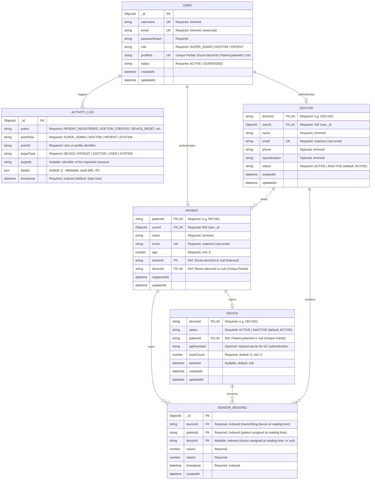
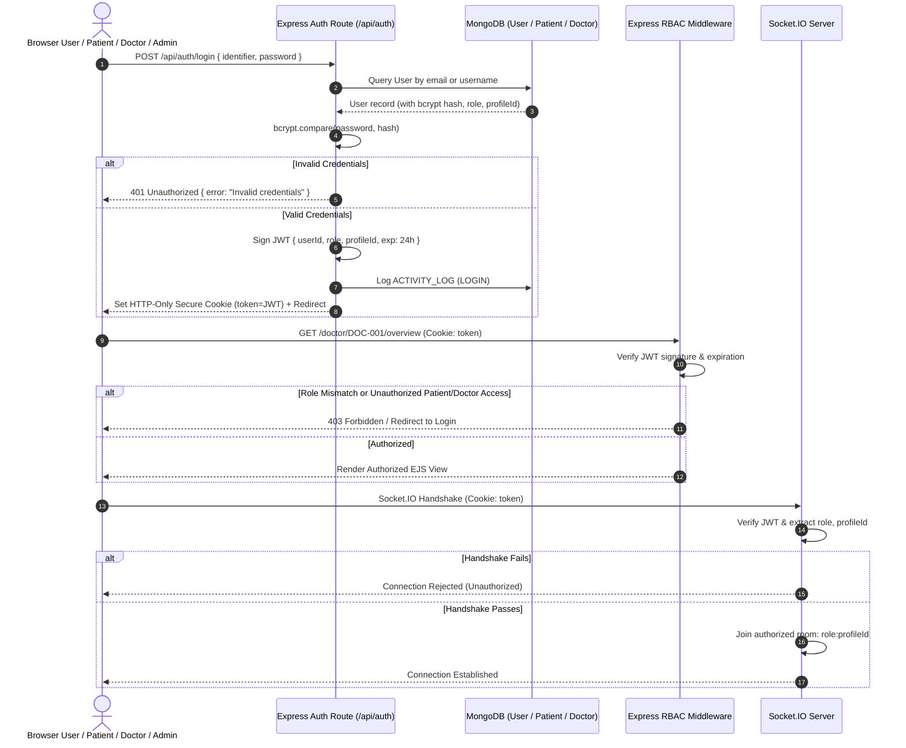
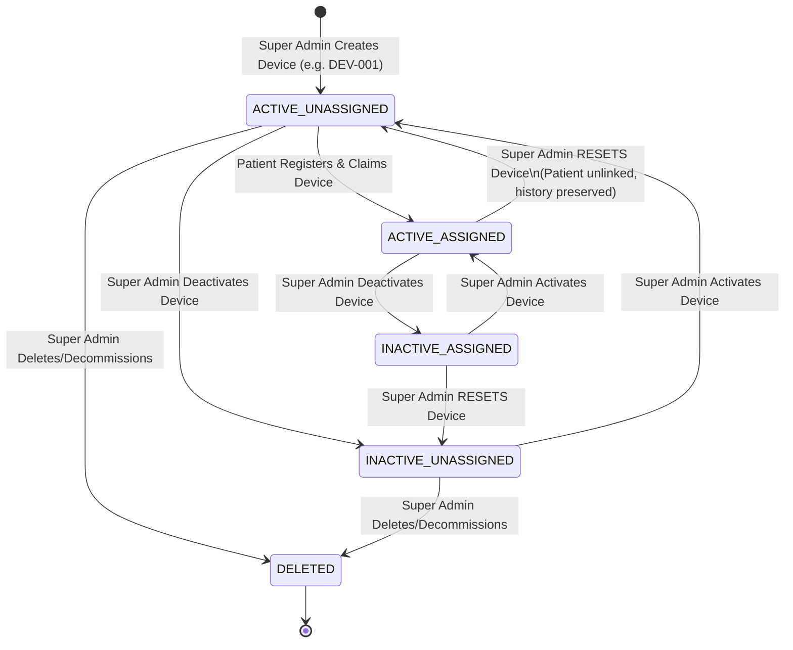
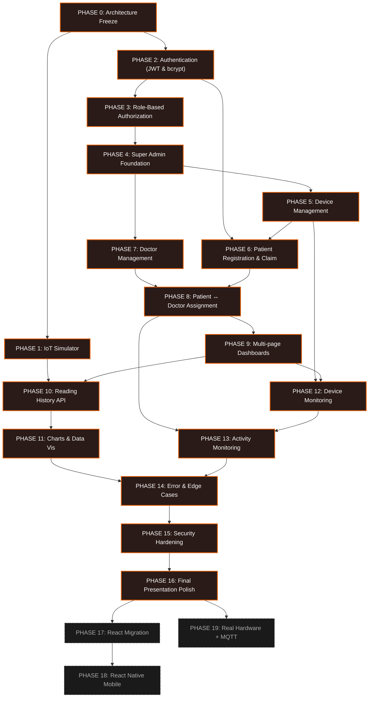

# HEALTH TRACKER — MASTER DEVELOPMENT ROADMAP
**Authoritative Single Source of Truth for Architecture, Implementation, and Lifecycles**
*Document Version: 1.0.0 | Status: FROZEN & AUTHORITATIVE*

---

## ARCHITECTURAL CORRECTIONS & ROADMAP CHANGES (OFFICIAL RECORD)

### ROADMAP CHANGE 001: Unique Partial Indexes for Nullable Foreign Keys
- **Sections Impacted:** Section 2 (Relational Invariants & Table 2.1 Index Specifications), Phase 0, Phase 5, Phase 6
- **Correction:** Replace `sparse unique` indexes on `Patient.deviceId` and `Device.patientId` (and `User.profileId`) with `unique partial indexes` (`partialFilterExpression: { <field>: { $type: "string" } }`).
- **Rationale:** In MongoDB, sparse indexes index documents containing explicit `null` values. Because unassigned foreign keys strictly store `null`, a sparse unique index triggers duplicate key errors upon inserting a second unassigned record. Unique partial indexes index strictly non-null string IDs, preserving the 1:1 hardware invariant while allowing multiple unassigned entities with `null`.

### ROADMAP CHANGE 002: Status Normalization to Centralized Enum ('ACTIVE')
- **Sections Impacted:** Phase 6 (Line 479), Phase 8 (Line 515)
- **Correction:** Update status check references from lowercase `'active'` to uppercase `'ACTIVE'` (or `DEVICE_STATUS.ACTIVE` / `DOCTOR_STATUS.ACTIVE`).
- **Rationale:** Aligns implementation with frozen centralized constants in `src/config/constants.js` and Mongoose schema enum definitions.

---

## EXECUTIVE SUMMARY & ARCHITECTURAL FOUNDATION

The **Health Tracker** system is an end-to-end, medical IoT telemetry and monitoring platform connecting patient-worn telemetry devices to healthcare professionals and system administrators. 

### Core Architectural Principles
1. **Database as the Source of Truth:** MongoDB persistently records all identities, hardware allocations, system audits, and time-series telemetry. Every dashboard route, historical chart, and access decision queries MongoDB first.
2. **Socket.IO for Live Event Delivery Only:** Socket.IO never acts as a database or state cache. It is purely an ephemeral, authenticated event pipe delivering real-time telemetry updates to authorized rooms (`patient:<patientId>` and `doctor:<doctorId>`).
3. **Strict Server-Side Role-Based Access Control (RBAC):** No client-side assertions or route parameters (`/patient/:patientId`) are trusted without server-side validation against verified JWT session claims and database associations.
4. **Hardware Lifecycle Integrity:** Telemetry hardware devices maintain explicit state transitions (Created, Activated, Deactivated, Claimed, Reset, Decommissioned). Resetting hardware unbinds patient association without deleting historical sensor data or patient medical records.
5. **Preservation of Medical Data Continuity:** Reassigning a patient between doctors or resetting a device never alters or cascades deletion to historical `SensorReading` records.

---

## 1. END-TO-END ARCHITECTURE DIAGRAM

```mermaid
flowchart TD
    subgraph Ingestion ["Hardware & Ingestion Tier"]
        HW["IoT Wearable Device / Simulator"] -->|HTTP POST /api/iot/data\n(Optional Device API Key)| IOT_API["Express IoT Ingestion Controller"]
        MQTT_NODE["Future: MQTT Broker"] -.->|Phase 19| IOT_API
    end

    subgraph CoreBackend ["Express Core Application Tier"]
        IOT_API -->|1. Validate Payload| VAL["Validation Middleware"]
        VAL -->|2. Check Device Status| DEV_SVC["Device Service"]
        DEV_SVC -->|3. Resolve Patient & Doctor| RESOLVE["Identity & Assignment Resolver"]
        RESOLVE -->|4. Persist Telemetry| DB_WRITE[(MongoDB SensorReading)]
        DB_WRITE -->|5. Trigger Event Dispatch| IO_DISPATCH["Socket.IO Dispatcher"]
        
        AUTH_ROUTER["Auth Controller\n(/api/auth)"] -->|JWT Issue / Verify| RBAC["Server-Side RBAC Middleware"]
        DASH_ROUTER["Dashboard Router\n(/patient, /doctor, /admin)"] -->|RBAC Guard| SSR["EJS View Engine / Hydration"]
    end

    subgraph Persistence ["Persistence Tier (MongoDB)"]
        USERS[(Users / Auth)]
        DOCTORS[(Doctors)]
        PATIENTS[(Patients)]
        DEVICES[(Devices)]
        READINGS[(SensorReadings)]
        ACTIVITY[(ActivityLogs)]
    end

    subgraph RealTime ["Real-Time Event Tier (Socket.IO)"]
        IO_DISPATCH -->|Room: patient:PAT-001| PAT_ROOM["Patient Socket Room"]
        IO_DISPATCH -->|Room: doctor:DOC-001| DOC_ROOM["Doctor Socket Room"]
    end

    subgraph ClientDashboards ["Frontend Presentation Tier (Vanilla CSS + Burnt-Orange UI)"]
        PAT_ROOM -->|WebSocket: sensor-reading| PAT_UI["Patient Multi-page Portal\n(/patient/*)"]
        DOC_ROOM -->|WebSocket: sensor-reading| DOC_UI["Doctor Multi-page Portal\n(/doctor/*)"]
        SSR --> PAT_UI
        SSR --> DOC_UI
        SSR --> ADMIN_UI["Super Admin Multi-page Portal\n(/admin/*)"]
    end

    DEV_SVC <--> DEVICES
    RESOLVE <--> PATIENTS
    RESOLVE <--> DOCTORS
    AUTH_ROUTER <--> USERS
    AUTH_ROUTER --> ACTIVITY
```

---

## 2. DATABASE RELATIONSHIP DIAGRAM (SCHEMA FREEZE)



### Relational Invariants & Formal Business Rules

1. **Strict Representation of Unassigned Relationships (`null` vs UI):**
   * Foreign key fields representing unassigned states (`Patient.doctorId`, `Patient.deviceId`, `Device.patientId`, `SensorReading.doctorId`) **MUST strictly store `null`** in the database.
   * **NEVER** insert `"UNASSIGNED"` as a sentinel string into any database ID or foreign key column.
   * Frontend EJS views and API formatting helpers translate `null` to the user-friendly string `"UNASSIGNED"` exclusively at presentation time.

2. **1:1 Current Device ↔ Current Patient Relationship:**
   * A patient has **at most one** CURRENT hardware device (`Patient.deviceId` is a single nullable field with a unique partial index).
   * A device has **at most one** CURRENT patient (`Device.patientId` is a single nullable field with a unique partial index).
   * Enforced via MongoDB unique partial indexes (`partialFilterExpression: { <field>: { $type: "string" } }`): no two patients can claim the same device, no two devices can be assigned to the same patient, and records with `null` are excluded from the uniqueness constraint.

3. **1:N Doctor ↔ Patient Invariant:**
   * A doctor manages zero to many patients (`1 : N`).
   * A patient has **at most one** currently assigned doctor (`Patient.doctorId` is a single string reference or `null`).
   * If a patient has no assigned physician, `Patient.doctorId = null`.

4. **Immutability of Historical Telemetry (`SensorReading`):**
   * `SensorReading` documents represent indelible physical measurements captured at a specific point in time. They are strictly **append-only**.
   * Historical `SensorReading` records **MUST NEVER be modified, updated, cascaded, or deleted** when:
     - A patient is reassigned to another doctor.
     - A hardware device is reset or unlinked.
     - A doctor account is disabled, suspended, or removed.
     - A device is deactivated or decommissioned.
   * Each `SensorReading` permanently retains the exact `patientId`, `deviceId`, and `doctorId` (or `null`) that were valid at the precise instant the telemetry packet was ingested.

5. **Device Reset Execution Rules:**
   * Resetting a hardware device atomically executes:
     1. `Device.patientId` is set to `null`.
     2. Former `Patient.deviceId` is set to `null`.
     3. `Device.resetCount` is incremented by 1.
     4. All historical `SensorReading` records for the device and patient remain unaltered.
     5. An immutable audit entry is appended to `ActivityLog` (`action: 'DEVICE_RESET'`, `actorId`, `targetId: deviceId`, `details: { previousPatientId }`).
   * The device returns to `ACTIVE + UNASSIGNED` inventory, ready to be claimed by a new patient.

6. **Doctor Removal Execution Rules:**
   * Removing or decommissioning a doctor atomically executes:
     1. Affected patients are **NEVER deleted**.
     2. All affected patients have their current `Patient.doctorId` updated to `null`.
     3. Historical `SensorReading.doctorId` values on existing readings remain intact.
     4. The doctor's login account is suspended (`User.status = 'SUSPENDED'`).
     5. An immutable audit entry is appended to `ActivityLog` (`action: 'DOCTOR_REMOVED'`, `targetId: doctorId`, `details: { unassignedPatientIds: [...] }`).
   * Super Admin can subsequently reassign these unassigned patients to new doctors.

7. **Unambiguous User ↔ Profile Linkage:**
   * `User` stores authentication credentials (`email`, `username`, `passwordHash`, `role`, `status`).
   * For `DOCTOR`: `Doctor.userId` references `User._id` (unique, 1:1), and `User.profileId` references `Doctor.doctorId` (unique partial, 1:1).
   * For `PATIENT`: `Patient.userId` references `User._id` (unique, 1:1), and `User.profileId` references `Patient.patientId` (unique partial, 1:1).
   * For `SUPER_ADMIN`: Seeded account with `role: 'SUPER_ADMIN'` and `profileId: null`. Admin accounts require no clinical profile document.

8. **Authentication Status vs. Profile Status Conflict Prevention:**
   * **Authority Rule:** `User.status` (`ACTIVE | SUSPENDED`) strictly governs platform authentication and session validity. If `User.status !== 'ACTIVE'`, login is rejected and all incoming JWT tokens are rejected with 403 Forbidden.
   * **Clinical Status:** `Doctor.status` (`ACTIVE | INACTIVE`) governs healthcare operations. An `INACTIVE` doctor cannot receive new patient assignments.
   * **Atomic Synchronization:**
     - When Super Admin disables a doctor (`Doctor.status = 'INACTIVE'`), the system atomically sets `User.status = 'SUSPENDED'` for that doctor, terminating active sessions.
     - When Super Admin reactivates a doctor (`Doctor.status = 'ACTIVE'`), the system atomically sets `User.status = 'ACTIVE'`.
     - Patient account suspension blocks login but preserves medical records for treating physicians.

### Database Index & Field Constraints Audit

| Collection | Field / Compound Key | Index Type | Constraint / Purpose |
| :--- | :--- | :--- | :--- |
| **User** | `email` | Unique | Required, lowercase, prevents duplicate accounts |
| **User** | `username` | Unique | Required, trimmed, allows username login |
| **User** | `profileId` | Unique Partial | Prevents two users linking to same doctorId/patientId; null for admin |
| **Doctor** | `doctorId` | Unique | Required primary business identifier (e.g. DOC-001) |
| **Doctor** | `userId` | Unique | Required 1:1 link to User credentials |
| **Doctor** | `email` | Unique | Required, mirrors User.email |
| **Patient** | `patientId` | Unique | Required primary business identifier (e.g. PAT-001) |
| **Patient** | `userId` | Unique | Required 1:1 link to User credentials |
| **Patient** | `email` | Unique | Required, mirrors User.email |
| **Patient** | `doctorId` | Standard (Indexed) | Facilitates doctor lookup queries; nullable (null = unassigned) |
| **Patient** | `deviceId` | Unique Partial | Enforces at most 1 device per patient; excludes null unassigned |
| **Device** | `deviceId` | Unique | Required primary hardware identifier (e.g. DEV-001) |
| **Device** | `patientId` | Unique Partial | Enforces at most 1 patient per device; excludes null unassigned |
| **Device** | `status` | Standard (Indexed) | Enables fast filtering for active unassigned devices |
| **SensorReading** | `{ patientId: 1, timestamp: -1 }` | Compound | Fast paginated history and chart retrieval per patient |
| **SensorReading** | `{ deviceId: 1, timestamp: -1 }` | Compound | Fast device telemetry health inspection |
| **SensorReading** | `{ doctorId: 1, timestamp: -1 }` | Compound | Clinical telemetry inspection across assigned patients |
| **ActivityLog** | `timestamp` | Descending (-1) | Fast chronological audit stream generation |
| **ActivityLog** | `{ actorId: 1, timestamp: -1 }` | Compound | Fast audit queries by actor |
| **ActivityLog** | `{ targetId: 1, timestamp: -1 }` | Compound | Fast audit queries by target entity (device, patient, doctor) |

---

## 3. ROLE-BASED ACCESS CONTROL (RBAC) MATRIX

| Resource / Action | PATIENT | DOCTOR | SUPER_ADMIN | Anonymous / Public |
| :--- | :---: | :---: | :---: | :---: |
| **Self Registration** | YES (with valid unassigned device) | NO | NO | YES |
| **Login / Authentication** | YES (email/username + pwd) | YES | YES | YES |
| **View Own Telemetry & History** | YES | NO (only as assigned doc) | YES | NO |
| **View Assigned Patients' Telemetry** | NO | YES | YES | NO |
| **View Unassigned / Other Patients** | NO | NO | YES | NO |
| **Join Socket.IO Room: `patient:<id>`** | YES (own ID only) | NO | YES | NO |
| **Join Socket.IO Room: `doctor:<id>`** | NO | YES (own ID only) | YES | NO |
| **Create Device** | NO | NO | YES | NO |
| **Activate / Deactivate Device** | NO | NO | YES | NO |
| **Reset Device (Unbind Patient)** | NO | NO | YES | NO |
| **Delete Device** | NO | NO | YES | NO |
| **Create Doctor Account** | NO | NO | YES | NO |
| **Disable / Reactivate Doctor** | NO | NO | YES | NO |
| **Reassign Patient to New Doctor** | NO | NO | YES | NO |
| **View System Activity Logs** | NO | NO | YES | NO |
| **Ingest IoT Telemetry (`/api/iot/data`)** | NO | NO | NO | IoT Device Only |

---

## 4. AUTHENTICATION & AUTHORIZATION FLOW



---

## 5. HARDWARE DEVICE LIFECYCLE & STATE MACHINE



### Critical Device State Rules
* **ACTIVE + UNASSIGNED:** Device is ready in inventory. Only devices in this state can be claimed during patient registration.
* **ACTIVE + ASSIGNED:** Device is actively bound to a patient. Ingestion accepted, telemetry routed to patient and assigned doctor.
* **INACTIVE + ASSIGNED:** Device temporarily disabled (e.g., billing, maintenance, device fault). Ingestion rejected at API level. Patient remains linked.
* **INACTIVE + UNASSIGNED:** Device in inventory but disabled. Cannot be claimed until activated.
* **RESET Operation:** Clears current `Device.patientId = null`, clears former `Patient.deviceId = null`, increments `Device.resetCount` by 1, and appends an immutable audit entry to `ActivityLog` (`action: 'DEVICE_RESET'`). Does **NOT** delete the patient profile and **NEVER** deletes, cascades, or modifies historical `SensorReading` records. Database strictly records `null` for unassigned relationships; the frontend UI formats `null` as `"UNASSIGNED"`.

---

## 6. MULTI-PAGE DASHBOARD ARCHITECTURE

The prototype replaces anchor-based single-page sections with true server-rendered multi-page architectures. Each route is protected by server-side RBAC and hydrates its view directly from MongoDB.

```
/ (Landing / Login Selection)
│
├── /auth
│   ├── /login                 (Login form for all roles)
│   ├── /register              (Patient registration with device claim)
│   └── /logout                (Session invalidation)
│
├── /patient
│   ├── /overview              (Current vital cards, assigned doctor info, device info, connection status)
│   ├── /live                  (Large-format real-time gauge/metrics, live Socket.IO pulse indicator)
│   ├── /history               (Paginated reading history table with timestamp and value filters)
│   └── /profile               (Patient details, device status, assigned doctor contact)
│
├── /doctor
│   ├── /overview              (Assigned patient count, active hardware count, alert feed, latest vitals)
│   ├── /patients              (Directory of assigned patients, search, device binding status, jump to patient)
│   ├── /monitor               (Multi-patient live telemetry monitoring grid)
│   └── /history               (Historical inspection per selected patient, trends)
│
└── /admin
    ├── /overview              (System stats: total doctors, patients, active/inactive devices, reading volume)
    ├── /doctors               (Doctor management: directory, create doctor modal/form, disable/enable, remove)
    ├── /patients              (Patient directory: assignment control, reassign doctor, device unbind trigger)
    ├── /devices               (Hardware inventory: create device, activate/deactivate, reset device, delete)
    └── /activity              (Real-time audit log stream: chronological system events, actor, target, timestamp)
```

---

## 7. COMPLETE PHASE-BY-PHASE IMPLEMENTATION ROADMAP

### PHASE 0 — Architecture & Database Schema Freeze
* **Goal:** Reconcile and formalize the data schemas, entity relationships, security rules, and state invariants without writing premature business logic.
* **Why:** Prevents breaking migrations, prevents data fragmentation, and ensures clear ownership across doctors, patients, and hardware.
* **Database Changes:** Formalize and freeze Mongoose schema definitions for `User`, `Doctor`, `Patient`, `Device`, `SensorReading`, and `ActivityLog`:
  - Strict `null` representation for unassigned foreign keys (`Patient.doctorId`, `Patient.deviceId`, `Device.patientId`, `SensorReading.doctorId`). Never store `"UNASSIGNED"` in the database.
  - Enforce 1:1 hardware constraint via string-filtered unique partial indexes on `Patient.deviceId` and `Device.patientId` (preserving support for multiple unassigned records with explicit null values).
  - Immutable telemetry: `SensorReading` records permanently preserve historical `deviceId`, `patientId`, and `doctorId` (or `null`) valid at ingestion time. Never updated or cascaded.
  - Device reset: Clears `Device.patientId = null`, `Patient.deviceId = null`, increments `resetCount`, preserves readings, logs `DEVICE_RESET`.
  - Doctor removal: Sets affected patients' `doctorId = null`, preserves historical `SensorReading.doctorId`, suspends `User.status = 'SUSPENDED'`, logs `DOCTOR_REMOVED`.
  - Unambiguous User ↔ Profile relationships via `userId` foreign keys and unique partial `User.profileId`.
  - Auth status (`User.status`) vs Profile status (`Doctor.status`) synchronization rules.
  - Full unique, unique partial, and compound indexes audited.
* **Backend Changes:** Define centralized constants for roles (`SUPER_ADMIN`, `DOCTOR`, `PATIENT`), device states (`ACTIVE`, `INACTIVE`), account statuses (`ACTIVE`, `SUSPENDED`), and audit action types.
* **Frontend Changes:** None.
* **Files Affected:** `src/models/*.js`, `src/config/constants.js`.
* **Dependencies:** None.
* **Verification Criteria:** Schemas validate successfully in an offline test script; indexes build correctly; no circular dependencies exist.
* **Security Considerations:** Enforce schema validation (required fields, enum constraints, unique and unique partial index constraints).

---

### PHASE 1 — IoT Automated Simulator
* **Goal:** Create a robust, multi-device headless simulator script (`tests/iotSimulator.js`) that simulates realistic continuous telemetry streams.
* **Why:** Manual HTTP POSTs cannot test real-time concurrency, multi-device routing, high-volume history charts, or reconnection handling.
* **Database Changes:** None.
* **Backend Changes:** Ensure `/api/iot/data` responds with detailed status codes (201 for written, 404 for unknown device, 403 for inactive device).
* **Frontend Changes:** None.
* **Files Affected:** `tests/iotSimulator.js`.
* **Dependencies:** Phase 0.
* **Verification Criteria:** Simulator starts via `node tests/iotSimulator.js --devices DEV-001,DEV-002 --interval 2000`, continuously feeds readings, and terminates gracefully on `SIGINT`.
* **Security Considerations:** Simulator respects simulated device API keys or payload signing headers.

---

### PHASE 2 — Authentication & Identity Foundation
* **Goal:** Implement secure authentication with bcrypt password hashing and JSON Web Tokens (JWT) stored in HTTP-Only cookies.
* **Why:** Protects sensitive medical data; replaces hardcoded URL navigation (`/patient/PAT-001`) with authenticated user identities.
* **Database Changes:** Create `User` collection. Seed development Super Admin account.
* **Backend Changes:** 
  - Add `bcryptjs` and `jsonwebtoken`.
  - Implement `POST /api/auth/register` (Patient only; validates device).
  - Implement `POST /api/auth/login` (supports email or username).
  - Implement `POST /api/auth/logout`.
* **Frontend Changes:** Create login and registration views in `src/views/auth/`.
* **Files Affected:** `src/models/User.js`, `src/controllers/authController.js`, `src/routes/authRoutes.js`, `src/views/auth/login.ejs`, `src/views/auth/register.ejs`.
* **Dependencies:** Phase 0.
* **Verification Criteria:** Patient registration generates bcrypt hash; login with valid credentials sets HTTP-Only JWT cookie; login with wrong password returns 401.
* **Security Considerations:** Salt rounds >= 10, JWT expiration (e.g., 24 hours), Secure and SameSite cookie attributes.

---

### PHASE 3 — Role-Based Authorization (RBAC) & Socket Authentication
* **Goal:** Implement server-side middleware to enforce strict role boundaries across both HTTP routes and WebSocket connections.
* **Why:** A patient must never access another patient's data or doctor controls; WebSocket connections must not join rooms without cryptographic token validation.
* **Database Changes:** None.
* **Backend Changes:**
  - Build `verifyToken`, `requireRole(['SUPER_ADMIN', ...])`, and `requireOwnership` middleware.
  - Implement Socket.IO handshake authentication middleware extracting JWT from handshake cookie/auth header.
  - Reject unauthorized room join requests.
* **Frontend Changes:** Attach token credentials to Socket.IO client handshakes.
* **Files Affected:** `src/middleware/authMiddleware.js`, `src/middleware/roleMiddleware.js`, `src/server.js`, `src/public/js/patient.js`, `src/public/js/doctor.js`.
* **Dependencies:** Phase 2.
* **Verification Criteria:** Attempting to access `/admin/*` as `PATIENT` returns 403 Forbidden; connecting to Socket.IO without JWT fails handshake.
* **Security Considerations:** No role checks trusted from request bodies or URL parameters; all authorization derived from verified JWT payload.

---

### PHASE 4 — Super Admin Foundation & Core Dashboard
* **Goal:** Build the primary Super Admin dashboard layout and overview metrics page (`/admin/overview`).
* **Why:** Provides centralized visibility into system health, registered doctors, patients, and hardware inventories.
* **Database Changes:** Add indexing on lookup fields (`createdAt`, `status`).
* **Backend Changes:**
  - Create `adminRoutes.js` and `adminController.js`.
  - Implement `/admin/overview` fetching total counts: doctors, patients, active/inactive devices, today's readings count.
* **Frontend Changes:** Create `src/views/admin/layout.ejs` and `src/views/admin/overview.ejs` matching the burnt-orange and dark theme.
* **Files Affected:** `src/routes/adminRoutes.js`, `src/controllers/adminController.js`, `src/views/admin/overview.ejs`, `src/public/css/admin.css`.
* **Dependencies:** Phase 3.
* **Verification Criteria:** Super Admin logs in, redirects to `/admin/overview`, and sees live aggregated system metrics.
* **Security Considerations:** Routes accessible strictly to `role === 'SUPER_ADMIN'`.

---

### PHASE 5 — Hardware Device Management
* **Goal:** Provide complete hardware inventory lifecycle management for Super Admins (Create, List, Activate, Deactivate, Reset, Delete).
* **Why:** Hardware devices must be pre-provisioned and tracked before being distributed to patients.
* **Database Changes:** Add `resetCount` and `lastSeen` fields to `Device` model. Enforce unique partial index on `Device.patientId`.
* **Backend Changes:**
  - Add routes: `POST /admin/devices` (Create device: DEV-XXX, default active, unassigned: `patientId = null`).
  - Add route: `PATCH /admin/devices/:deviceId/activate` & `deactivate`.
  - Add route: `POST /admin/devices/:deviceId/reset` (atomically sets `Device.patientId = null`, sets former `Patient.deviceId = null`, increments `Device.resetCount` by 1, preserves all historical `SensorReading` records, appends `DEVICE_RESET` to `ActivityLog`).
  - Add route: `DELETE /admin/devices/:deviceId` (only permitted if unassigned: `patientId === null`).
* **Frontend Changes:** Create `src/views/admin/devices.ejs` with inventory table, status badges, action buttons, and reset confirmation modals.
* **Files Affected:** `src/models/Device.js`, `src/controllers/adminDeviceController.js`, `src/routes/adminRoutes.js`, `src/views/admin/devices.ejs`.
* **Dependencies:** Phase 4.
* **Verification Criteria:** Admin creates `DEV-003`; status is `ACTIVE + UNASSIGNED`. Admin resets assigned device: `Device.patientId` and `Patient.deviceId` become `null` in DB, device becomes claimable for new registration, and patient reading history remains completely intact.
* **Security Considerations:** Reset operations require explicit admin confirmation to prevent accidental patient disassociation.

---

### PHASE 6 — Patient Registration & Device Claiming Pipeline
* **Goal:** Wire the public patient registration flow to automatically claim an existing, active, unassigned hardware device.
* **Why:** Enforces hardware-backed patient enrollment; ensures no orphan or duplicate device claims.
* **Database Changes:** None (relies on unique partial indexes on `Patient.deviceId` and `Device.patientId`).
* **Backend Changes:**
  - In `authController.register`:
    1. Check if `deviceId` exists in `Device` collection.
    2. Verify `device.status === 'ACTIVE'` (or `DEVICE_STATUS.ACTIVE`).
    3. Verify `device.patientId === null` (unassigned).
    4. Create `Patient` and `User` records in a managed transaction/atomic operation.
    5. Update `Device.patientId = patient.patientId` and `Patient.deviceId = device.deviceId`.
    6. Log `PATIENT_REGISTERED` and `DEVICE_ASSIGNED` in `ActivityLog`.
* **Frontend Changes:** Update `register.ejs` with client validation and descriptive error displays for already-claimed devices.
* **Files Affected:** `src/controllers/authController.js`, `src/views/auth/register.ejs`.
* **Dependencies:** Phase 2, Phase 5.
* **Verification Criteria:** Attempting registration with a nonexistent or already-claimed device returns clear 400 error; valid registration atomically links patient and device (1:1 reciprocal assignment).
* **Security Considerations:** Prevent race conditions in device claiming via atomic find-and-update or database transactions.

---

### PHASE 7 — Doctor Management (Admin Provisioning & Lifecycle)
* **Goal:** Enable Super Admin to provision, view, suspend, reactivate, and remove doctors.
* **Why:** Doctors are accredited professionals and cannot self-register; admin must manage professional accounts.
* **Database Changes:** Add `status` field (`ACTIVE | INACTIVE`) and `userId` field to `Doctor` model.
* **Backend Changes:**
  - Implement `GET /admin/doctors` (list all doctors and assigned patient counts).
  - Implement `POST /admin/doctors` (creates Doctor and credentials User account, returns temporary credentials).
  - Implement `PATCH /admin/doctors/:doctorId/status` (toggle active/inactive; atomically synchronizes linked `User.status` between `ACTIVE` and `SUSPENDED`).
  - Implement `DELETE /admin/doctors/:doctorId` (does not delete patients; sets affected patients' `doctorId = null`; preserves historical `SensorReading.doctorId`; suspends linked `User` account; logs `DOCTOR_REMOVED`).
* **Frontend Changes:** Create `src/views/admin/doctors.ejs` with doctor directory, creation modal with generated credentials view, and deactivation toggles.
* **Files Affected:** `src/models/Doctor.js`, `src/controllers/adminDoctorController.js`, `src/routes/adminRoutes.js`, `src/views/admin/doctors.ejs`.
* **Dependencies:** Phase 4.
* **Verification Criteria:** Super Admin creates Dr. Roy; temporary password shown; Dr. Roy logs in successfully. When Dr. Roy is deleted/removed, affected patients have `doctorId` set to `null` (displayed as "UNASSIGNED" in UI), all historical readings remain intact, and patients remain accessible for reassignment.
* **Security Considerations:** Enforce strong password generation for newly created doctors; prompt password change on first login.

---

### PHASE 8 — Patient ↔ Doctor Assignment Engine
* **Goal:** Provide Super Admin with granular control to assign and reassign patients to doctors.
* **Why:** Medical care transitions require patients to be transferred between physicians without disrupting care history.
* **Database Changes:** None.
* **Backend Changes:**
  - Implement `PATCH /admin/patients/:patientId/assign-doctor` `{ doctorId }`.
  - Verify target doctor exists and `doctor.status === 'ACTIVE'` (or `DOCTOR_STATUS.ACTIVE`).
  - Update `Patient.doctorId = doctorId` for future telemetry.
  - Log `PATIENT_REASSIGNED` with previous and new doctor IDs in `ActivityLog`.
* **Frontend Changes:** Create `src/views/admin/patients.ejs` with patient table, current doctor badge, and "Change Doctor" dropdown/modal.
* **Files Affected:** `src/controllers/adminPatientController.js`, `src/routes/adminRoutes.js`, `src/views/admin/patients.ejs`.
* **Dependencies:** Phase 7.
* **Verification Criteria:** Patient reassigned from Dr. Sharma to Dr. Roy: historical `SensorReading` records permanently retain Dr. Sharma's `doctorId` for medical audit, but subsequent telemetry and doctor dashboards immediately reflect Dr. Roy.
* **Security Considerations:** Previous doctor immediately loses Socket.IO authorization to stream that patient's live telemetry.

---

### PHASE 9 — Multi-Page Dashboard Architecture
* **Goal:** Split single-page anchor dashboards into dedicated, bookmarkable, server-rendered multi-page structures.
* **Why:** Anchor navigation limits deep linking, breaks browser back/forward ergonomics, and prevents scalable view-specific logic.
* **Database Changes:** None.
* **Backend Changes:**
  - Refactor `dashboardRoutes.js` into dedicated sub-routers:
    - `/patient/overview`, `/patient/live`, `/patient/history`, `/patient/profile`
    - `/doctor/overview`, `/doctor/patients`, `/doctor/monitor`, `/doctor/history`
    - `/admin/overview`, `/admin/doctors`, `/admin/patients`, `/admin/devices`, `/admin/activity`
  - Hydrate each page with only the data required for that specific view.
* **Frontend Changes:** Create modular EJS views with shared navigation header and active navigation state highlighting.
* **Files Affected:** `src/routes/patientRoutes.js`, `src/routes/doctorRoutes.js`, `src/routes/adminRoutes.js`, `src/views/patient/*.ejs`, `src/views/doctor/*.ejs`, `src/views/admin/*.ejs`.
* **Dependencies:** Phase 3, Phase 4, Phase 8.
* **Verification Criteria:** Clicking "History" navigates to `/patient/history` with browser history push; page refreshes preserve state and active navigation styling.
* **Security Considerations:** Ensure every individual page route executes RBAC middleware; no route leakage.

---

### PHASE 10 — Reading History Engine & Paginated API
* **Goal:** Implement a high-performance paginated REST endpoint and UI for querying historical telemetry.
* **Why:** Telemetry history is essential for clinical trend identification and diagnostic evaluation.
* **Database Changes:** Compound index on `SensorReading`: `{ patientId: 1, timestamp: -1 }`.
* **Backend Changes:**
  - Create `GET /api/readings/:patientId` with query params `page`, `limit`, `startDate`, `endDate`.
  - Enforce authorization: Patient can query self; Doctor can query assigned patient; Admin can query all.
  - Return paginated results with total count, page count, and ISO timestamps.
* **Frontend Changes:** Build history data table view with pagination controls, date pickers, and export-to-CSV stub.
* **Files Affected:** `src/controllers/readingController.js`, `src/routes/apiRoutes.js`, `src/views/patient/history.ejs`, `src/views/doctor/history.ejs`.
* **Dependencies:** Phase 9.
* **Verification Criteria:** `GET /api/readings/PAT-001?page=1&limit=20` returns newest 20 readings in descending chronological order; unauthorized access returns 403.
* **Security Considerations:** Prevent denial-of-service via query limits (max `limit = 100`).

---

### PHASE 11 — Charts & Time-Series Data Visualization
* **Goal:** Integrate interactive visual line charts rendering `Value 1` and `Value 2` over time, hydrated by MongoDB and updated live via Socket.IO.
* **Why:** Raw numbers are difficult for clinicians and patients to interpret; visual trends reveal physiological patterns immediately.
* **Database Changes:** None.
* **Backend Changes:** Provide historical time-slice endpoint for chart initialization (`GET /api/readings/:patientId/recent?limit=50`).
* **Frontend Changes:**
  - Include Chart.js (or lightweight canvas-based chart library).
  - Hydrate chart from initial MongoDB readings.
  - Listen to `sensor-reading` Socket.IO event: push new timestamp and values, shift old points smoothly.
* **Files Affected:** `src/public/js/patientCharts.js`, `src/public/js/doctorCharts.js`, `src/views/patient/overview.ejs`, `src/views/doctor/history.ejs`.
* **Dependencies:** Phase 10.
* **Verification Criteria:** Loading the page renders historical trend line; sending a live IoT reading causes the chart line to extend in real time without refreshing.
* **Security Considerations:** Sanitize reading values to prevent client-side chart injection.

---

### PHASE 12 — Device Monitoring & Telemetry Health Dashboard
* **Goal:** Introduce telemetry health diagnostics: Last Seen, Online/Offline status, Transmission Frequency, and Reset Tracking.
* **Why:** Healthcare providers must immediately detect when a patient's monitor loses connectivity or stops transmitting.
* **Database Changes:** Ensure `Device.lastSeen` updates on every valid ingestion.
* **Backend Changes:**
  - Update `iotRoutes.js` to update `Device.lastSeen = new Date()`.
  - Compute device connection health (`Online` if lastSeen < 60s ago, `Stale` if < 10m, `Offline` otherwise).
* **Frontend Changes:** Display pulse indicators (Green = Online, Amber = Stale, Gray = Offline) across Admin and Doctor dashboards.
* **Files Affected:** `src/routes/iotRoutes.js`, `src/views/admin/devices.ejs`, `src/views/doctor/monitor.ejs`.
* **Dependencies:** Phase 5, Phase 9.
* **Verification Criteria:** Stopping the IoT simulator turns device status indicator from green to amber and then gray after timeout thresholds.
* **Security Considerations:** Restrict device status modification to automated ingestion and admin endpoints.

---

### PHASE 13 — Centralized System Activity & Audit Trail
* **Goal:** Build an immutable system activity log capturing security events, administrative modifications, and hardware state changes.
* **Why:** Essential for HIPAA-style audit compliance, diagnostic forensics, and accountability.
* **Database Changes:** Index `ActivityLog` on `{ timestamp: -1 }` and `{ actorId: 1 }`.
* **Backend Changes:**
  - Implement centralized helper `logActivity(action, actorRole, actorId, targetType, targetId, details)`.
  - Instrument Auth, Doctor, Patient, and Device controllers with logging.
  - Implement `GET /admin/activity` with filtering by action category and actor.
* **Frontend Changes:** Create `src/views/admin/activity.ejs` showing formatted event stream with actor pills, action badges, and timestamps.
* **Files Affected:** `src/models/ActivityLog.js`, `src/utils/activityLogger.js`, `src/controllers/adminController.js`, `src/views/admin/activity.ejs`.
* **Dependencies:** Phase 4, Phase 8.
* **Verification Criteria:** Resetting a device or reassigning a doctor generates an entry visible in `/admin/activity` within milliseconds.
* **Security Considerations:** Activity log collection is append-only; no update or delete routes exist.

---

### PHASE 14 — Error Handling, Edge Cases & System Robustness
* **Goal:** Harden the platform against edge cases: duplicate claims, malformed payloads, rapid bursts, expired tokens, and network disconnects.
* **Why:** Medical telemetry platforms cannot crash or hang due to invalid inputs or temporary database unavailability.
* **Database Changes:** None.
* **Backend Changes:**
  - Centralized Express error handler middleware.
  - Rate limiting on `/api/iot/data` (prevent flooding).
  - Validation schemas using Joi / express-validator for all incoming routes.
  - Graceful Mongoose reconnection handlers.
* **Frontend Changes:**
  - Friendly error toast notifications.
  - Socket.IO reconnecting banner ("Reconnecting to live telemetry...").
  - Form validation error feedback.
* **Files Affected:** `src/middleware/errorHandler.js`, `src/middleware/validationMiddleware.js`, `src/public/js/socketStatus.js`.
* **Dependencies:** All previous phases.
* **Verification Criteria:** POSTing corrupted JSON or duplicate device claims returns structured error `{ success: false, message: ... }` with HTTP 400 without crashing server.
* **Security Considerations:** Suppress stack traces in non-development environments.

---

### PHASE 15 — Security Hardening & Penetration Defense
* **Goal:** Implement production-grade application security defenses.
* **Why:** Protect sensitive Protected Health Information (PHI) against unauthorized extraction and tampering.
* **Database Changes:** None.
* **Backend Changes:**
  - Implement Helmet for HTTP security headers (CSP, HSTS, X-Frame-Options).
  - Configure CORS whitelist strictly matching allowed hostnames.
  - Implement rate limiting on auth endpoints (prevent brute-force login).
  - Environment variable schema validation on server startup (`dotenv-safe` or manual validation).
  - IoT ingestion device API key verification.
* **Frontend Changes:** Secure cookie handling, CSRF protection tokens for administrative forms.
* **Files Affected:** `src/server.js`, `src/config/security.js`, `src/middleware/rateLimiter.js`.
* **Dependencies:** Phase 14.
* **Verification Criteria:** Running security audit scans reports secure headers; brute force attempts trigger 429 Too Many Requests.
* **Security Considerations:** Ensure zero plain-text secrets in repository; sanitize all database query inputs against NoSQL injection.

---

### PHASE 16 — Final Prototype & Presentation Polish
* **Goal:** Elevate visual aesthetics, micro-interactions, responsive states, and build a seamless Super Admin demonstration flow.
* **Why:** Maximizes stakeholder confidence and ensures an impactful demonstration of the end-to-end medical IoT system.
* **Database Changes:** Comprehensive seed script populating demo doctors, patients, devices, and historical telemetry curves.
* **Backend Changes:** Add a secure demo "Quick-Switch" or impersonation route for presentation purposes (restricted to development/admin).
* **Frontend Changes:**
  - Refine burnt-orange + deep dark aesthetic with smooth glassmorphism accents.
  - Add loading skeletons, empty state illustrations, and transition animations.
  - Responsive tablet/desktop layouts.
* **Files Affected:** `src/public/css/*.css`, `src/views/**/*.ejs`, `src/seed/demoSeed.js`.
* **Dependencies:** Phases 1–15.
* **Verification Criteria:** Demonstrator can execute the full story: Create Doctor -> Create Device -> Register Patient -> Stream Simulator -> Live Charts Update -> Reassign Doctor -> Reset Device -> Audit Log in under 3 minutes without error.
* **Security Considerations:** Demo switch routes strictly disabled when `NODE_ENV === 'production'`.

---

### PHASE 17 — Modern Frontend Architecture (React Migration)
* **Goal:** Migrate frontend client interfaces from EJS server-rendered templates to a modern React + TypeScript single-page application.
* **Why:** Provides component reusability, complex client-side state management for multi-patient grids, and typed API contracts.
* **Database Changes:** None.
* **Backend Changes:** Ensure all endpoints provide pure JSON REST APIs alongside the existing EJS views during transition.
* **Frontend Changes:** Initialize Vite + React + TypeScript application consuming `/api/*` and Socket.IO.
* **Files Affected:** `frontend/` directory, new React components.
* **Dependencies:** Phase 16 (Stabilized backend).
* **Verification Criteria:** React client mirrors all patient, doctor, and admin capabilities with 100% feature parity.
* **Security Considerations:** Implement token refresh rotations and secure client memory storage.

---

### PHASE 18 — Mobile Telemetry Application (React Native)
* **Goal:** Deliver a dedicated iOS and Android mobile app for patients using React Native.
* **Why:** Patients require convenient on-the-go access to live vitals, historical trends, and doctor communication.
* **Database Changes:** Optional push notification tokens field in `User`.
* **Backend Changes:** Push notification service integration (FCM / APNs) for vital alert thresholds.
* **Frontend Changes:** React Native mobile codebase sharing types and API clients with Phase 17.
* **Files Affected:** `mobile/` directory.
* **Dependencies:** Phase 17.
* **Verification Criteria:** Mobile app connects to backend, authenticates patient, and displays live vitals over cellular data.
* **Security Considerations:** Biometric login (FaceID / Fingerprint) integration and local secure storage (Keychain).

---

### PHASE 19 — Physical Hardware Integration & MQTT Pipeline
* **Goal:** Transition from HTTP simulator to real embedded hardware (e.g., ESP32 / Arduino with pulse oximeter / ECG sensors) communicating over MQTT.
* **Why:** Complete transition from simulated prototype to real-world medical hardware deployment.
* **Database Changes:** Store device firmware version and hardware MAC addresses.
* **Backend Changes:**
  - Deploy Aedes / Mosquitto MQTT broker.
  - Build MQTT ingestion worker subscribing to `telemetry/+/data`.
  - Validate device certificate/token, persist to MongoDB, emit to Socket.IO.
* **Frontend Changes:** Firmware version and battery level telemetry indicators.
* **Files Affected:** `src/mqtt/mqttServer.js`, `firmware/esp32_firmware.ino`.
* **Dependencies:** Phase 15, Phase 16.
* **Verification Criteria:** Physical ESP32 micro-controller powers on, connects to Wi-Fi, posts sensor readings via MQTT, and vitals appear on web dashboard in under 500ms.
* **Security Considerations:** MQTTS (TLS encrypted MQTT) with mutual certificate authentication.

---

## 8. MASTER DEPENDENCY GRAPH



---

## 9. RECOMMENDED STEP-BY-STEP EXECUTION ORDER

To maintain an unbroken, testable system at every stage, execute development in this strict sequence:

```
[SPRINT 1: Core Security & Simulation Engine]
1. PHASE 0 — Architecture Freeze & Model Formalization
2. PHASE 1 — Multi-Device Headless IoT Simulator (tests/iotSimulator.js)
3. PHASE 2 — Authentication Foundation (User model, bcrypt, JWT cookies)
4. PHASE 3 — Server-Side RBAC & Socket.IO Handshake Guard

[SPRINT 2: Super Admin & Device Operations]
5. PHASE 4 — Super Admin Portal Skeleton (/admin/overview)
6. PHASE 5 — Device Inventory Management (Create, Activate, Deactivate, Reset, Delete)
7. PHASE 6 — Patient Registration Flow with Atomic Device Claiming
8. PHASE 7 — Doctor Management (Admin Provisioning, Suspension, Deletion)
9. PHASE 8 — Patient ↔ Doctor Assignment Engine (History Preservation)

[SPRINT 3: Multi-Page User Experience & Clinical Views]
10. PHASE 9 — Multi-Page Dashboard Restructuring (Patient, Doctor, Admin)
11. PHASE 10 — Reading History Pagination & Filtering API
12. PHASE 11 — Time-Series Interactive Charts (MongoDB Hydration + Socket.IO Append)
13. PHASE 12 — Device Health & Connection Diagnostics (Online/Offline/Stale)
14. PHASE 13 — System-Wide Audit Log & Real-Time Activity Feed

[SPRINT 4: Hardening & Presentation Readiness]
15. PHASE 14 — Comprehensive Edge Case & Error Handling
16. PHASE 15 — Security Hardening (Helmet, Rate Limiting, CORS, Key Validation)
17. PHASE 16 — UI Polish, Smooth Animations, Quick-Switch Demo Flow

[SPRINT 5: Ecosystem Expansion (Future)]
18. PHASE 17 — Frontend React + TypeScript Migration
19. PHASE 18 — Patient Mobile App (React Native)
20. PHASE 19 — Physical Embedded Hardware & MQTT Ingestion
```

---

*This document stands as the definitive, frozen master roadmap for the Health Tracker project. All future development shall follow the phase boundaries, dependency rules, and schema definitions specified herein.*
