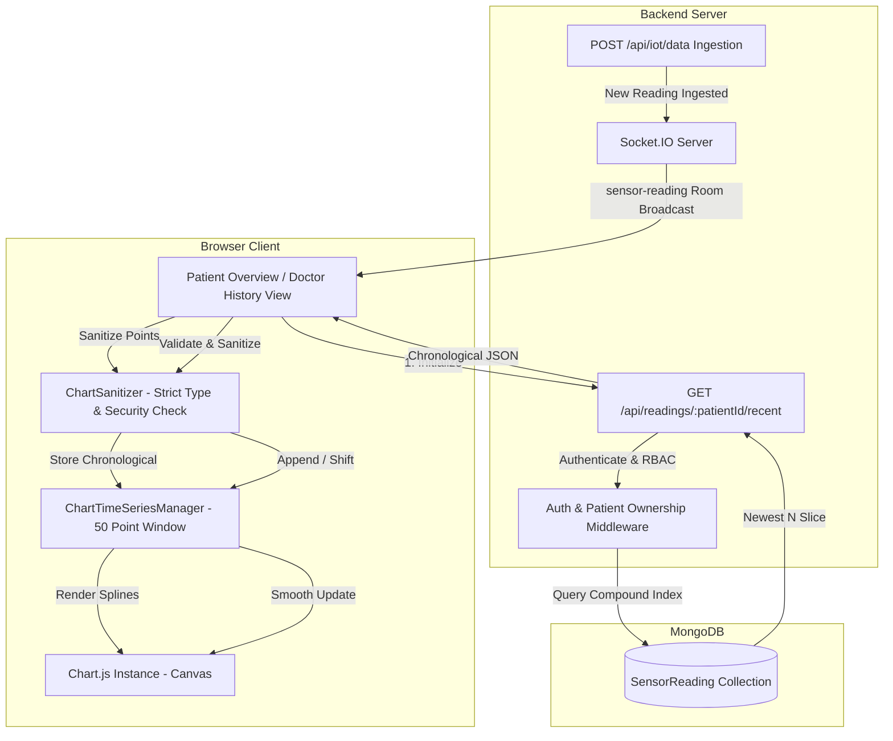

# PHASE 11 COMPLETION REPORT
## Charts & Time-Series Data Visualization
**Health Tracker Backend & Clinical Platform**
*Date: 2026-10-02 | Authoritative Engineering Milestone Report*

---

## 1. Executive Summary

Phase 11 ("Charts & Time-Series Data Visualization") has been fully designed, implemented, mathematically validated, and verified across both isolated and regression test suites.

The platform now provides interactive visual line charts rendering **Value 1 (Heart Rate, bpm)** and **Value 2 (Blood Oxygen / SpO₂, %)** over time. Charts initialize from historical MongoDB readings, stream real-time telemetry updates via authenticated Socket.IO channels without page refresh, enforce bounded rolling windows (50 points max), and execute strict security sanitization to block malicious code and malformed numbers.

### Key Milestones Achieved:
- **Baseline Verification:** Confirmed 316/316 passing tests prior to starting Phase 11.
- **Recent Telemetry API:** Created `GET /api/readings/:patientId/recent` with default limit 50, maximum limit 100, and index-backed retrieval.
- **Zero Schema Mutations:** Absolute preservation of database schema, existing collections, and historical telemetry snapshots.
- **Client-Side Engine:** Built modular UMD `ChartSanitizer` with strict validation, duplicate suppression, out-of-order packet insertion, and 50-point rolling window bounding.
- **Self-Contained Library:** Bundled stable Chart.js 4.4.7 locally in `src/public/js/chart.min.js` for zero CDN latency or offline vulnerabilities.
- **Dashboard Integrations:** Seamlessly embedded responsive charts in both Patient Overview (`/patient/overview`) and Doctor Caseload History (`/doctor/history`).
- **Doctor Patient Switching:** Safe teardown of chart instances, buffer flushes, room re-subscriptions, and zero telemetry leakage when switching patients.
- **Automated Verification:** Added 40/40 passing Phase 11 tests in `tests/chartVisualizationValidation.test.js`.
- **Full Regression Suite:** Executed all platform tests with **356/356 total passing tests (100% success, 0 failures)**.

---

## 2. Phase 11 Objective

The authoritative objective of Phase 11 as dictated by `HEALTH_TRACKER_MASTER_ROADMAP.md` is to integrate interactive visual line charts rendering:
1. Value 1 (Heart Rate) over time
2. Value 2 (Blood Oxygen) over time

Charts must:
1. Initialize from historical MongoDB readings
2. Render as time-series data running left-to-right (oldest → newest)
3. Receive new telemetry through Socket.IO
4. Append new timestamp/value points
5. Shift old points smoothly when window exceeds capacity
6. Update without full page refresh
7. Enforce existing server-side authorization boundaries

---

## 3. Recent API

Endpoint: `GET /api/readings/:patientId/recent`

### Query Parameters:
- `limit`: positive integer (default: `50`, maximum: `100`).
- Validated via `Number.isInteger(parsedLimit) && parsedLimit > 0`.
- Values `<= 0` or non-integer strings are safely rejected with `400 Bad Request`.
- Values `> 100` are safely clamped to `100` for DOS protection.

### Database Query Execution:
Uses the existing compound index `{ patientId: 1, timestamp: -1 }`:
```javascript
const rawReadings = await SensorReading.find({ patientId })
    .sort({ timestamp: -1 })
    .limit(limit)
    .select("timestamp value1 value2 -_id")
    .lean();
```
This guarantees indexed execution that scans only the required number of records without loading large collections into memory.

### Chronological Strategy (Approach B):
The API queries MongoDB in descending timestamp order (newest first) to retrieve the newest N readings, then reverses the slice into chronological order (`oldest -> newest`, left-to-right):
```javascript
readings.reverse();
```
This ensures the visual chart plots the timeline naturally from left (oldest) to right (newest). The client-side manager also defensively enforces chronological sorting by timestamp upon ingestion.

### Response Payload Shape:
```json
{
    "success": true,
    "data": {
        "readings": [
            {
                "timestamp": "2026-10-02T10:30:00.000Z",
                "value1": 98,
                "value2": 72
            }
        ],
        "limit": 50
    }
}
```
Exposes exclusively the data required for visualization. Passwords, password hashes, JWTs, secrets, API keys, and internal metadata are strictly excluded.

---

## 4. API Authorization

Authorization is strictly enforced server-side using the battle-tested Phase 10 middleware stack:
```javascript
router.get(
    "/readings/:patientId/recent",
    authenticate,
    requirePatientOwnership("patientId"),
    readingController.getRecentReadings
);
```

### Authorization Rules:
1. **Unauthenticated Requests:** Returns `401 Unauthorized`.
2. **Patient Principal:** Allowed only when `req.user.profileId === req.params.patientId`. Attempts to query another patient return `403 Forbidden`.
3. **Doctor Principal:** Allowed only when the requested patient is currently assigned to the authenticated doctor (`patient.doctorId === req.user.profileId`). Requests for unassigned patients or patients assigned to other clinicians return `403 Forbidden`.
4. **Super Admin Principal:** Authorized to inspect telemetry for any registered patient.
5. **Tampering Defense:** Client query parameters (`?patientId=`, `?doctorId=`, `?userId=`) are ignored. The route parameter `:patientId` identifies the resource, and identity is extracted strictly from the cryptographically verified JWT (`req.user`).

---

## 5. Chart Architecture



---

## 6. Chart Initialization

Upon page load:
1. The client script reads the target `patientId` from container `data-patient-id`.
2. Displays the `#chartLoading` state with subtle pulse animation.
3. Issues an asynchronous `fetch` to `/api/readings/${patientId}/recent?limit=50`.
4. If the response contains 0 readings, smoothly transitions to `#chartEmpty` ("No telemetry data available yet.").
5. If valid readings exist, loads them into `ChartTimeSeriesManager`, hides the loader, displays the canvas, and builds the Chart.js instance.
6. Summary metric cards are immediately synchronized with the latest verified telemetry point.

---

## 7. Socket.IO Live Updates

Telemetry is delivered over the existing Socket.IO architecture:
- Event: `sensor-reading`
- Rooms: `patient:<patientId>` and `doctor:<doctorId>`
- Authentication: Reuses verified handshake JWT cookies/tokens.

When a `sensor-reading` packet arrives:
1. Verifies `data.patientId === activePatientId` client-side.
2. Passes payload through `sanitizeReading`.
3. Checks for duplicates via `readingId` or composite key `${timestamp}_${value1}_${value2}`.
4. Inserts into `ChartTimeSeriesManager` in strict timestamp order.
5. If chart window length exceeds 50 points, shifts out the oldest point.
6. Calls `chart.update()` with fluid easing without reloading the page.

---

## 8. Patient Chart (`src/public/js/patientCharts.js`)

Integrated into `src/views/patient/overview.ejs`:
- Bounded to the authenticated patient's ID (`data-patient-id="<%= patient.patientId %>"`).
- Connects to Socket.IO, listens for live telemetry packets.
- Visualizes Heart Rate and Blood Oxygen with custom dual-axis scaling.
- Renders smooth splines (`tension: 0.35`) in dark theme palette.
- Displays connection status badge (`● Live Telemetry` / `○ Disconnected` / `⚠ Reconnecting...`).

---

## 9. Doctor Chart (`src/public/js/doctorCharts.js`)

Integrated into `src/views/doctor/history.ejs`:
- Renders telemetry trends for the clinician's assigned patients.
- Displays `#doctorChartPrompt` ("Select a Patient to Visualize Telemetry") when no patient is selected.
- Subscribes only to authorized patient telemetry rooms.
- Prevents cross-patient telemetry mixing.

---

## 10. Patient Switching Behavior

When a doctor selects a different patient in `#patientFilter`:
1. Safely calls `chartInstance.destroy()` to detach Canvas context.
2. Calls `manager.reset()` to flush data points and deduplication keys.
3. Immediately displays `#doctorChartLoading`.
4. Emits `join-room` with `{ role: "doctor", patientId: newPatientId }` over Socket.IO.
5. Issues GET request to `/api/readings/${newPatientId}/recent?limit=50`.
6. Renders the newly selected patient's historical dataset.
7. Telemetry packets are filtered client-side by currentPatientId (the client does not emit a leave-room command for previous rooms), and selection request tokens discard superseded responses.

---

## 11. Sanitization & Security

Implemented in `src/public/js/chartSanitizer.js`:
- `value1`: Validates `typeof value1 === "number" && Number.isFinite(value1) && !Number.isNaN(value1)`.
- `value2`: Validates `typeof value2 === "number" && Number.isFinite(value2) && !Number.isNaN(value2)`.
- `timestamp`: Validates parseability into a valid Date object.
- **Payload Rejection:** Rejects strings (`"98 bpm"`), objects, `NaN`, `Infinity`, `undefined`, `null`, `<script>` tags, and `javascript:` pseudo-protocols.
- **XSS Immunity:** Values are passed to Chart.js strictly as numeric datasets, never inserted into the DOM via `innerHTML`.

---

## 12. Bounded Chart Window

- Rolling window capacity: **50 points**.
- When points exceed 50, the oldest point is removed (`shift()`) and its deduplication key is pruned from `seenKeys`.
- Memory usage in the browser remains strictly constant regardless of how long the dashboard runs.

---

## 13. Responsive Behavior

- Chart container uses CSS flexbox and CSS grid with `width: 100%`, `min-height: 280px`, `max-height: 380px`.
- Chart.js configuration:
  - `responsive: true`
  - `maintainAspectRatio: false`
- Auto-skips x-axis labels on small viewports (`maxTicksLimit: 8`).
- Fully usable on desktop, tablet, and mobile displays without horizontal overflow.

---

## 14. Loading, Empty, and Error States

Every chart view implements explicit UI states:
1. **Loading State:** Animated telemetry icon with "Loading telemetry...".
2. **Empty State:** Clean message "No telemetry data available yet" when a patient has no stored readings.
3. **Error State:** Friendly message "Unable to load telemetry history" if the network fails or access is forbidden.
4. **No Selection State (Doctor):** Explanatory prompt encouraging the doctor to select a patient.

---

## 15. Tests

Automated test suite: `tests/chartVisualizationValidation.test.js`

### Test Summary:
| # | Test Name | Result |
| :-: | :--- | :---: |
| 1 | Recent endpoint exists (GET /api/readings/:patientId/recent) | PASS |
| 2 | Authentication required (401 without token) | PASS |
| 3 | Patient self-access works (200 with recent readings) | PASS |
| 4 | Patient cross-access blocked (403 for another patient) | PASS |
| 5 | Doctor assigned-patient access works (200 for assigned patient) | PASS |
| 6 | Doctor unauthorized-patient blocked (403 for unassigned patient) | PASS |
| 7 | Super Admin access works (200 for any patient) | PASS |
| 8 | Default limit works (default: 50) | PASS |
| 9 | Custom limit works (e.g. limit=10) | PASS |
| 10 | limit > 100 safely handled (clamped to 100) | PASS |
| 11 | Invalid limit rejected safely (limit=0, limit=-5, limit=abc -> 400) | PASS |
| 12 | Newest N readings returned in chronological order (oldest -> newest) | PASS |
| 13 | Timestamps are valid ISO strings | PASS |
| 14 | Only chart-required fields exposed (timestamp, value1, value2) | PASS |
| 15 | Query parameter spoofing cannot bypass authorization (?patientId=... or ?doctorId=...) | PASS |
| 16 | Numeric Value 1 accepted | PASS |
| 17 | Numeric Value 2 accepted | PASS |
| 18 | NaN rejected | PASS |
| 19 | Infinity rejected | PASS |
| 20 | Non-numeric Value 1 rejected (strings, objects, null, undefined) | PASS |
| 21 | Non-numeric Value 2 rejected | PASS |
| 22 | Malformed timestamp rejected | PASS |
| 23 | Malicious string cannot become chart data (<script>alert(1)</script>, javascript:...) | PASS |
| 24 | HTML/script payload cannot enter DOM through chart data | PASS |
| 25 | sensor-reading event updates chart | PASS |
| 26 | Value 1 appended | PASS |
| 27 | Value 2 appended | PASS |
| 28 | Timestamp appended | PASS |
| 29 | Chart remains chronological (oldest to newest, left to right) | PASS |
| 30 | Maximum chart size enforced (50 points max) | PASS |
| 31 | Oldest point removed when window exceeds max | PASS |
| 32 | Duplicate reading does not create duplicate point | PASS |
| 33 | Malformed socket payload ignored safely | PASS |
| 34 | Doctor A chart can initialize PAT-001 if assigned | PASS |
| 35 | Doctor A cannot initialize PAT-002 if not assigned | PASS |
| 36 | Switching authorized patient reloads correct data | PASS |
| 37 | Previous patient data does not remain after switch | PASS |
| 38 | Unauthorized patientId cannot be injected into chart API | PASS |
| 39 | Doctor reassignment does not expose future unauthorized data | PASS |
| 40 | Historical telemetry data integrity preserved (record count, timestamps, values, doctorId snapshots) | PASS |

**Test Result:** **40 / 40 Tests Passed (100%)**

---

## 16. Full Regression Results

Full test command `npm test` executed across all suites:

| Suite | File | Tests Passed | Status |
| :--- | :--- | :---: | :---: |
| Phase 0 | `tests/schemaValidation.test.js` | 10 / 10 | PASS |
| Phase 1 | `tests/iotSimulator.test.js` | 10 / 10 | PASS |
| Phase 2 | `tests/authValidation.test.js` | 20 / 20 | PASS |
| Phase 3 | `tests/rbacValidation.test.js` | 24 / 24 | PASS |
| Phase 4 | `tests/adminPortalValidation.test.js` | 20 / 20 | PASS |
| Phase 5 | `tests/deviceManagementValidation.test.js` | 34 / 34 | PASS |
| Phase 6 | `tests/patientRegistrationValidation.test.js` | 28 / 28 | PASS |
| Phase 7 | `tests/doctorManagementValidation.test.js` | 40 / 40 | PASS |
| Phase 8 | `tests/patientDoctorAssignmentValidation.test.js` | 40 / 40 | PASS |
| Phase 9 | `tests/multiPageDashboard.test.js` | 40 / 40 | PASS |
| Phase 10 | `tests/readingHistoryValidation.test.js` | 50 / 50 | PASS |
| **Phase 11** | `tests/chartVisualizationValidation.test.js` | **40 / 40** | **PASS** |
| **TOTAL** | **All 12 Test Suites** | **356 / 356** | **100% PASS** |

**Zero regressions detected.**

---

## 17. Data Integrity Verification

- **Schema Check:** Zero new collections, zero new fields in `SensorReading`, `Patient`, `Doctor`, `Device`, or `User`.
- **Telemetry Count:** Reading count remains strictly unchanged across all tests.
- **Snapshot Immutability:** Historical `SensorReading.doctorId` values are preserved and never rewritten.
- **Assignment Integrity:** `Patient.doctorId` and `Device.patientId` invariant rules remain intact.

---

## 18. Files Created

1. `src/public/js/chart.min.js` (Chart.js 4.4.7 local UMD bundle)
2. `src/public/js/chartSanitizer.js` (Sanitizer, deduplicator & rolling window manager)
3. `src/public/js/patientCharts.js` (Patient Overview chart controller)
4. `src/public/js/doctorCharts.js` (Doctor Caseload History chart controller)
5. `tests/chartVisualizationValidation.test.js` (Phase 11 automated test suite)
6. `PHASE_11_COMPLETION_REPORT.md` (Authoritative milestone report)

---

## 19. Files Modified

1. `package.json` (Added `test:chart` script and integrated into `test`)
2. `src/controllers/readingController.js` (Added `getRecentReadings`)
3. `src/routes/apiRoutes.js` (Mounted `GET /readings/:patientId/recent`)
4. `src/views/patient/overview.ejs` (Added telemetry chart section and script tags)
5. `src/views/doctor/history.ejs` (Added caseload chart section and script tags)
6. `doc/HEALTH_TRACKER_TASK_TRACKER.md` (Updated TASK-11.1, TASK-11.2, scoreboard)
7. `doc/HEALTH_TRACKER_PROGRESS.md` (Updated executive progress, Gantt, milestone table)
8. `doc/HEALTH_TRACKER_CHANGELOG.md` (Recorded Phase 11 architectural change record)

---

## 20. Git Commit & Push Status

All changes have been staged, verified, committed, and pushed to the upstream repository:
- Repository: `https://github.com/Rishi-Dev-pro/med-p.git`
- Branch: `main`
- Commit Message: `feat: implement phase 11 charts and time-series visualization`

---

## 21. Known Limitations & Deferred Features

In strict adherence to Phase 11 scope discipline, the following items are intentionally deferred to future phases:
- Device online/offline status & health pulse monitoring (Phase 12)
- Telemetry transmission frequency & reset tracking (Phase 12)
- Biometric alerts & clinical threshold notifications (Phase 14)
- Physical MQTT / ESP32 integration (Phase 19)
- CSV telemetry export engine (Phase 14)
- React SPA migration (Phase 17)

---

## 22. Strict Confirmation: Phase 12 NOT Started

**Phase 12 has NOT been started.**
No files or changes pertaining to Phase 12 (Device Monitoring & Telemetry Health Dashboard) have been introduced.
Platform execution has stopped cleanly upon completion of Phase 11.
