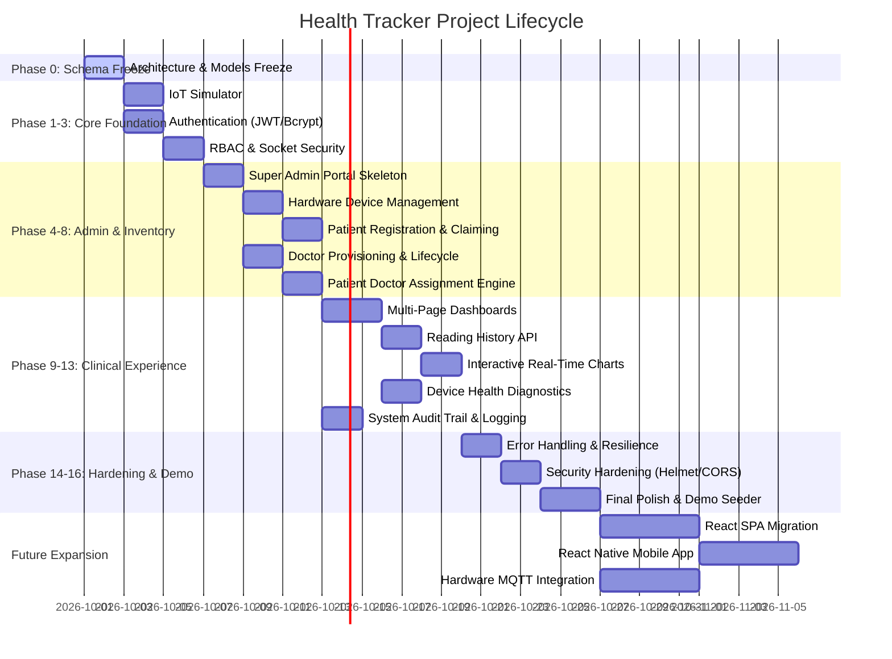

# HEALTH TRACKER — PROJECT STATUS DASHBOARD
**Live Executive Progress & Milestone Report**

---

## EXECUTIVE SUMMARY

| Metric | Status |
| :--- | :--- |
| **Current Phase** | **PHASE 0: Architecture & Database Schema Freeze** (Pending execution) |
| **Current Task** | `TASK-0.1: Constants Definition` (Awaiting kickoff) |
| **Overall Progress** | **0.0%** (0 of 46 tasks completed across 20 phases) |
| **Completed Phases** | None (0 / 20) |
| **Active Tasks** | None |
| **Blocked Tasks** | None |
| **Upcoming Tasks** | `TASK-0.1` through `TASK-0.8` (Phase 0 deliverables) |
| **Verification Status** | All schemas and application code in existing state; no tests executed yet |
| **Last Updated Timestamp** | 2026-09-30 22:20:00 IST |

---

## PHASE EXECUTION PIPELINE

---

## MILESTONE BREAKDOWN & PROGRESS

| Phase | Phase Name | Status | Tasks (Done/Total) | Progress |
| :---: | :--- | :---: | :---: | :---: |
| **0** | Architecture & Database Schema Freeze | `NOT_STARTED` | 0 / 8 | 0% |
| **1** | IoT Automated Simulator | `NOT_STARTED` | 0 / 2 | 0% |
| **2** | Authentication & Identity Foundation | `NOT_STARTED` | 0 / 5 | 0% |
| **3** | Role-Based Authorization & Socket Auth | `NOT_STARTED` | 0 / 3 | 0% |
| **4** | Super Admin Foundation & Core Dashboard | `NOT_STARTED` | 0 / 3 | 0% |
| **5** | Hardware Device Management | `NOT_STARTED` | 0 / 3 | 0% |
| **6** | Patient Registration & Device Claiming | `NOT_STARTED` | 0 / 2 | 0% |
| **7** | Doctor Management (Admin Provisioning) | `NOT_STARTED` | 0 / 4 | 0% |
| **8** | Patient ↔ Doctor Assignment Engine | `NOT_STARTED` | 0 / 2 | 0% |
| **9** | Multi-Page Dashboard Architecture | `NOT_STARTED` | 0 / 3 | 0% |
| **10** | Reading History Engine & Paginated API | `NOT_STARTED` | 0 / 2 | 0% |
| **11** | Charts & Time-Series Data Visualization | `NOT_STARTED` | 0 / 2 | 0% |
| **12** | Device Monitoring & Telemetry Health | `NOT_STARTED` | 0 / 2 | 0% |
| **13** | Centralized System Activity & Audit Trail | `NOT_STARTED` | 0 / 3 | 0% |
| **14** | Error Handling & System Robustness | `NOT_STARTED` | 0 / 3 | 0% |
| **15** | Security Hardening & Penetration Defense | `NOT_STARTED` | 0 / 2 | 0% |
| **16** | Final Prototype & Presentation Polish | `NOT_STARTED` | 0 / 2 | 0% |
| **17** | Modern Frontend Architecture (React) | `NOT_STARTED` | 0 / 1 | 0% |
| **18** | Mobile Telemetry App (React Native) | `NOT_STARTED` | 0 / 1 | 0% |
| **19** | Physical Hardware & MQTT Pipeline | `NOT_STARTED` | 0 / 1 | 0% |

---

## KNOWN DISCREPANCIES (ACTUAL CODEBASE VS FROZEN ROADMAP)
*Audited 2026-09-30 against physical repository files:*

1. **Missing Models:**
   - `User` model does not exist (`src/models/User.js` missing).
   - `ActivityLog` model does not exist (`src/models/ActivityLog.js` missing).
   - Centralized system constants file does not exist (`src/config/constants.js` missing).
2. **Schema Inconsistencies in Prototype Models:**
   - `Device.js`: Lacks sparse unique index on `patientId`; `patientId` is required rather than nullable; missing `resetCount`, `lastSeen`, and `apiKeyHash`.
   - `Patient.js`: Lacks `userId`, `email`, and `deviceId` fields; `doctorId` is required string rather than nullable reference (`null` for unassigned).
   - `Doctor.js`: Lacks `userId`, `email`, `phone`, `specialization`, and `status` (`ACTIVE`/`INACTIVE`).
   - `SensorReading.js`: Requires `doctorId` (cannot record readings for unassigned patients); lacks compound indexes `{ patientId: 1, timestamp: -1 }` and `{ deviceId: 1, timestamp: -1 }`.
3. **Route & Security Discrepancies:**
   - Ingestion route (`src/routes/iotRoutes.js`) returns HTTP 200 instead of HTTP 201 on write; rejects readings with 404 if `patient.doctorId` is null; lacks API key validation or rate limiting.
   - Dashboard routes (`src/routes/dashboardRoutes.js`) are unauthenticated single-page endpoints (`/patient/:patientId`, `/doctor/:doctorId`) relying on URL params with no JWT verification or server-side RBAC.
   - Socket.IO server (`src/server.js`) accepts unauthenticated handshake connections and client-emitted `join-room` events with arbitrary role/userId claims.
   - Admin routes and views do not exist.

---

## NEXT IMMEDIATE ACTIONS
1. Complete Project Control Documents setup and push to GitHub.
2. Await instruction to start Phase 0.
3. In Phase 0: Implement `src/config/constants.js`, formalize and freeze schemas in `src/models/*.js`, and verify offline with `tests/schemaValidation.test.js`.
