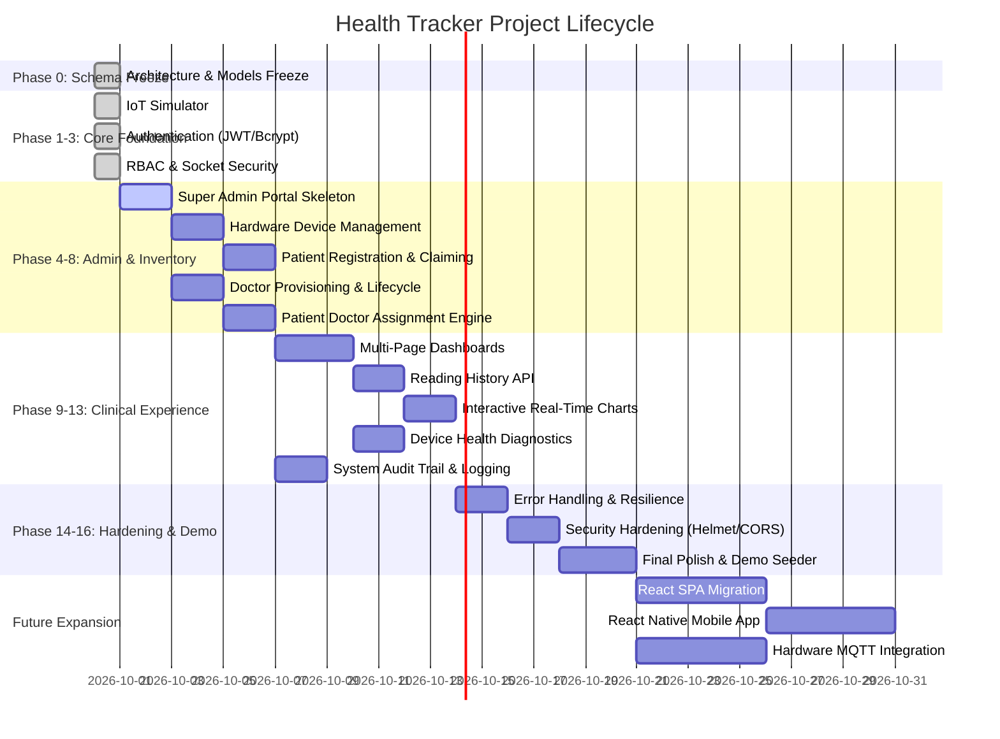

# HEALTH TRACKER — PROJECT STATUS DASHBOARD
**Live Executive Progress & Milestone Report**

---

## EXECUTIVE SUMMARY

| Metric | Status |
| :--- | :--- |
| **Current Phase** | **PHASE 4: Super Admin Foundation & Core Dashboard** (Phase 3 Completed) |
| **Current Task** | `TASK-4.1: Build Admin Controller and routes guarded by requireRole(['SUPER_ADMIN'])` |
| **Overall Progress** | **39.1%** (18 of 46 tasks completed across 20 phases) |
| **Completed Phases** | **Phase 0: Schema Freeze**, **Phase 1: IoT Simulator**, **Phase 2: Auth Foundation**, **Phase 3: RBAC & Socket Auth** (4 / 20) |
| **Active Tasks** | None |
| **Blocked Tasks** | None |
| **Upcoming Tasks** | `TASK-4.1` to `TASK-4.3` (Phase 4 deliverables) |
| **Verification Status** | Phase 3 verified: `tests/rbacValidation.test.js` passed 24/24 tests; Phase 2: 20/20 PASS; Phase 1: 10/10 PASS; Phase 0: 10/10 PASS (64/64 Total PASS) |
| **Last Updated Timestamp** | 2026-09-30 23:40:00 IST |

---

## PHASE EXECUTION PIPELINE

---

## MILESTONE BREAKDOWN & PROGRESS

| Phase | Phase Name | Status | Tasks (Done/Total) | Progress |
| :---: | :--- | :---: | :---: | :---: |
| **0** | Architecture & Database Schema Freeze | `DONE` | 8 / 8 | 100% |
| **1** | IoT Automated Simulator | `DONE` | 2 / 2 | 100% |
| **2** | Authentication & Identity Foundation | `DONE` | 5 / 5 | 100% |
| **3** | Role-Based Authorization & Socket Auth | `DONE` | 3 / 3 | 100% |
| **4** | Super Admin Foundation & Core Dashboard | `NOT_STARTED` | 0 / 3 | 0% |
| **5** | Hardware Device Management | `NOT_STARTED` | 0 / 3 | 0% |
| **6** | Patient Registration & Device Claiming | `NOT_STARTED` | 0 / 2 | 0% |
| **7** | Doctor Management (Admin Provisioning) | `NOT_STARTED` | 0 / 4 | 0% |
| **8** | Patient ↔ Doctor Assignment Engine | `NOT_STARTED` | 0 / 2 | 0% |
| **9** | Multi-Page Dashboard Architecture | `NOT_STARTED` | 0 / 3 | 0% |
| **10** | Reading History Engine & Paginated API | `NOT_STARTED` | 0 / 2 | 0% |
| **11** | Charts & Time-Series Data Visualization | `NOT_STARTED` | 0 / 2 | 0% |
| **12** | Device Monitoring & Telemetry Health | `NOT_STARTED` | 0 / 2 | 0% |
| **13** | Centralized System Activity & Audit Trail | `NOT_STARTED` | 0 / 3 | 0% |
| **14** | Error Handling & System Robustness | `NOT_STARTED` | 0 / 3 | 0% |
| **15** | Security Hardening & Penetration Defense | `NOT_STARTED` | 0 / 2 | 0% |
| **16** | Final Prototype & Presentation Polish | `NOT_STARTED` | 0 / 2 | 0% |
| **17** | Modern Frontend Architecture (React) | `NOT_STARTED` | 0 / 1 | 0% |
| **18** | Mobile Telemetry App (React Native) | `NOT_STARTED` | 0 / 1 | 0% |
| **19** | Physical Hardware & MQTT Pipeline | `NOT_STARTED` | 0 / 1 | 0% |

---

## KNOWN DISCREPANCIES (ACTUAL CODEBASE VS FROZEN ROADMAP)
*Updated following Phase 2 completion:*

1. **Resolved in Phases 0, 1, and 2:**
   - Database schema models frozen (`User`, `Doctor`, `Patient`, `Device`, `SensorReading`, `ActivityLog`) with unique partial indexes.
   - IoT telemetry ingestion pipeline aligned to return 201 Created on valid write, 404 on unknown device, 403 on inactive device, and tolerate nullable `doctorId`.
   - Automated multi-device headless simulator script implemented (`tests/iotSimulator.js`).
   - Secure authentication foundation implemented with `bcryptjs` password hashing (salt rounds >= 10) and `jsonwebtoken` issuance (`src/utils/authUtils.js`, `src/config/auth.js`).
   - Patient registration endpoint (`POST /api/auth/register`) with device validation (existence, active status, unassigned state).
   - Unified login endpoint (`POST /api/auth/login`) supporting email, username, or patient name with account status enforcement.
   - Logout endpoint (`POST /api/auth/logout`) clearing HTTP-only authentication cookies.
   - Reusable authentication middleware (`src/middleware/authMiddleware.js`) extracting JWT from cookies or headers and verifying active status.
   - Server-rendered EJS views for login (`/login`) and registration (`/register`) with burnt-orange dark theme styling.
   - Super Admin account seeder (`src/seed/seedAdmin.js`, `src/seed/seed.js`) with idempotent execution.

1. **Resolved in Phases 0, 1, 2, and 3:**
   - Database schema models frozen (`User`, `Doctor`, `Patient`, `Device`, `SensorReading`, `ActivityLog`) with unique partial indexes.
   - IoT telemetry ingestion pipeline aligned to return 201 Created on valid write, 404 on unknown device, 403 on inactive device, and tolerate nullable `doctorId`.
   - Automated multi-device headless simulator script implemented (`tests/iotSimulator.js`).
   - Secure authentication foundation implemented with `bcryptjs` password hashing (salt rounds >= 10) and `jsonwebtoken` issuance (`src/utils/authUtils.js`, `src/config/auth.js`).
   - Server-side RBAC middleware (`src/middleware/roleMiddleware.js`) enforcing `requireRole`, `requirePatientOwnership`, and `requireDoctorOwnership`.
   - Dashboard routes (`/patient/:patientId` and `/doctor/:doctorId`) strictly protected against cross-patient and cross-doctor data enumeration.
   - Socket.IO cryptographic handshake JWT authentication via `io.use()` validating active account status and rejecting suspended/unauthenticated connections.
   - Socket.IO room joining authorization isolating `patient:<id>` and `doctor:<id>` telemetry strictly by server-verified DB relationships and decoupling historical readings from reassignment.
   - Foundation admin authorization established via `requireRole('SUPER_ADMIN')` on `/api/admin/status`.

2. **Route & Security Discrepancies (Scheduled for Phase 4+):**
   - Super Admin portal and doctor management endpoints await Phase 4 & Phase 7.
   - Device inventory lifecycle and reset operations await Phase 5.

---

## NEXT IMMEDIATE ACTIONS
1. Commit Phase 3 implementation and push to GitHub.
2. Await instruction to start Phase 4 (Super Admin Foundation & Core Dashboard).
3. In Phase 4: Implement Super Admin Controller, overview metric aggregators, and dark burnt-orange administrative layouts (`TASK-4.1` to `TASK-4.3`).
