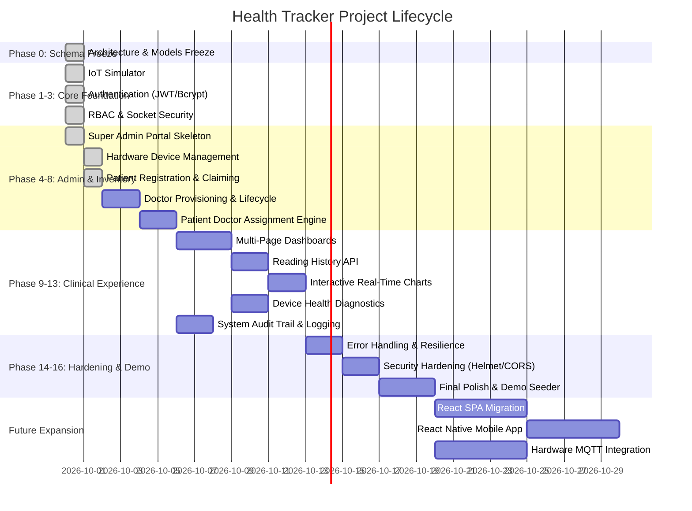

# HEALTH TRACKER — PROJECT STATUS DASHBOARD
**Live Executive Progress & Milestone Report**

---

## EXECUTIVE SUMMARY

| Metric | Status |
| :--- | :--- |
| **Current Phase** | **PHASE 7: Doctor Management (Admin Provisioning & Lifecycle)** (Phase 6 Completed) |
| **Current Task** | Awaiting Phase 7 Authorization (`TASK-7.1: Implement Doctor management endpoints`) |
| **Overall Progress** | **56.5%** (26 of 46 tasks completed across 20 phases) |
| **Completed Phases** | **Phase 0: Schema Freeze**, **Phase 1: IoT Simulator**, **Phase 2: Auth Foundation**, **Phase 3: RBAC & Socket Auth**, **Phase 4: Super Admin Foundation**, **Phase 5: Hardware Device Management**, **Phase 6: Patient Registration & Device Claiming** (7 / 20) |
| **Active Tasks** | None |
| **Blocked Tasks** | None |
| **Upcoming Tasks** | `TASK-7.1` to `TASK-7.4` (Phase 7 deliverables) |
| **Verification Status** | Phase 6 verified: `tests/patientRegistrationValidation.test.js` passed 28/28 tests; All 146 regression tests passed across Phase 0 (10), Phase 1 (10), Phase 2 (20), Phase 3 (24), Phase 4 (20), Phase 5 (34), and Phase 6 (28). |
| **Last Updated Timestamp** | 2026-10-01 01:38:00 IST |

---

## PHASE EXECUTION PIPELINE

---

## MILESTONE BREAKDOWN & PROGRESS

| Phase | Phase Name | Status | Tasks (Done/Total) | Progress |
| :---: | :--- | :---: | :---: | :---: |
| **0** | Architecture & Database Schema Freeze | `DONE` | 8 / 8 | 100% |
| **1** | IoT Automated Simulator | `DONE` | 2 / 2 | 100% |
| **2** | Authentication & Identity Foundation | `DONE` | 5 / 5 | 100% |
| **3** | Role-Based Authorization & Socket Auth | `DONE` | 3 / 3 | 100% |
| **4** | Super Admin Foundation & Core Dashboard | `DONE` | 3 / 3 | 100% |
| **5** | Hardware Device Management | `DONE` | 3 / 3 | 100% |
| **6** | Patient Registration & Device Claiming | `DONE` | 2 / 2 | 100% |
| **7** | Doctor Management (Admin Provisioning) | `NOT_STARTED` | 0 / 4 | 0% |
| **8** | Patient ↔ Doctor Assignment Engine | `NOT_STARTED` | 0 / 2 | 0% |
| **9** | Multi-Page Dashboard Architecture | `NOT_STARTED` | 0 / 3 | 0% |
| **10** | Reading History Engine & Paginated API | `NOT_STARTED` | 0 / 2 | 0% |
| **11** | Charts & Time-Series Data Visualization | `NOT_STARTED` | 0 / 2 | 0% |
| **12** | Device Monitoring & Telemetry Health | `NOT_STARTED` | 0 / 2 | 0% |
| **13** | Centralized System Activity & Audit Trail | `NOT_STARTED` | 0 / 3 | 0% |
| **14** | Error Handling & System Robustness | `NOT_STARTED` | 0 / 3 | 0% |
| **15** | Security Hardening & Penetration Defense | `NOT_STARTED` | 0 / 2 | 0% |
| **16** | Final Prototype & Presentation Polish | `NOT_STARTED` | 0 / 2 | 0% |
| **17** | Modern Frontend Architecture (React) | `NOT_STARTED` | 0 / 1 | 0% |
| **18** | Mobile Telemetry App (React Native) | `NOT_STARTED` | 0 / 1 | 0% |
| **19** | Physical Hardware & MQTT Pipeline | `NOT_STARTED` | 0 / 1 | 0% |

---

## KNOWN DISCREPANCIES & RESOLUTIONS

1. **Resolved in Phases 0, 1, 2, 3, 4, 5, and 6:**
   - Database schema models frozen (`User`, `Doctor`, `Patient`, `Device`, `SensorReading`, `ActivityLog`) with unique partial indexes.
   - IoT telemetry ingestion pipeline aligned to return 201 Created on valid write, 404 on unknown device, 403 on inactive device, and tolerate nullable `doctorId`.
   - Automated multi-device headless simulator script implemented (`tests/iotSimulator.js`).
   - Secure authentication foundation implemented with `bcryptjs` password hashing and `jsonwebtoken` issuance.
   - Server-side RBAC middleware (`src/middleware/roleMiddleware.js`) enforcing `requireRole`, `requirePatientOwnership`, and `requireDoctorOwnership`.
   - Socket.IO cryptographic handshake JWT authentication via `io.use()` validating active account status.
   - Super Admin portal foundation and layout (`/admin`, `/admin/overview`, `/admin/doctors`, `/admin/patients`, `/admin/devices`, `/admin/activity`).
   - **Hardware Device Management (Phase 5):** Complete device lifecycle engine in `src/controllers/adminDeviceController.js` and `/api/admin/devices` endpoints (Create, List, Detail, Activate, Deactivate, Reset, Delete, Assign).
   - **Reset Invariants:** Atomic reset engine sets `Device.patientId = null` and former `Patient.deviceId = null`, increments `resetCount`, strictly preserves all historical `SensorReading` telemetry records and Patient account, and logs `DEVICE_RESET` in `ActivityLog`.
   - **Decommission Safety:** Deleting a device is permitted only if unassigned (`patientId === null`); historical readings are strictly preserved.
   - **Patient Registration & Device Claim (Phase 6):** Server-authoritative device claim validation via `GET /api/auth/device-status/:deviceId`, atomic claim via `findOneAndUpdate` preventing race conditions, compensation rollback on partial failures, client role/patientId spoofing defense, and debounced real-time frontend verification UI.

2. **Route & Operational Discrepancies (Scheduled for Phase 7+):**
   - Doctor creation, credential generation, and suspension management await Phase 7.
   - Patient ↔ doctor assignment engine and UI await Phase 8.

---

## NEXT IMMEDIATE ACTIONS
1. Commit Phase 6 implementation and push to GitHub.
2. Await instruction before beginning Phase 7 (Doctor Management: Admin Provisioning & Lifecycle).
