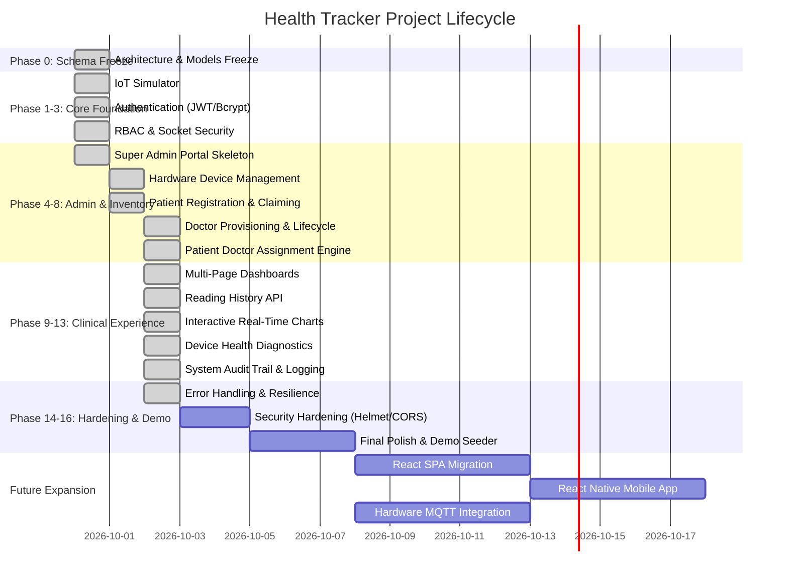

# HEALTH TRACKER — PROJECT STATUS DASHBOARD
**Live Executive Progress & Milestone Report**

---

## EXECUTIVE SUMMARY

| Metric | Status |
| :--- | :--- |
| **Current Phase** | **PHASE 14: Error Handling, Edge Cases & System Robustness** (Completed) |
| **Current Task** | Phase 14 Completed — Awaiting Phase 15 Authorization (`TASK-15.1: Security Hardening & Penetration Defense`) |
| **Overall Progress** | **92.2%** (47 of 51 tasks completed across Phases 0-16; 100% of Phases 0-14) |
| **Completed Phases** | **Phase 0: Schema Freeze**, **Phase 1: IoT Simulator**, **Phase 2: Auth Foundation**, **Phase 3: RBAC & Socket Auth**, **Phase 4: Super Admin Foundation**, **Phase 5: Hardware Device Management**, **Phase 6: Patient Registration & Device Claiming**, **Phase 7: Doctor Provisioning & Account Lifecycle**, **Phase 8: Patient ↔ Doctor Assignment Engine**, **Phase 9: Multi-Page Dashboard Architecture**, **Phase 10: Reading History Engine & Paginated API**, **Phase 11: Charts & Time-Series Data Visualization**, **Phase 12: Device Monitoring & Telemetry Health Dashboard**, **Phase 13: Centralized System Activity & Audit Trail**, **Phase 14: Error Handling & System Robustness** (15 / 20) |
| **Active Tasks** | None |
| **Blocked Tasks** | None |
| **Upcoming Tasks** | `TASK-15.1` to `TASK-15.2` (Phase 15 deliverables) |
| **Verification Status** | Phase 14 verified: `tests/errorRobustnessValidation.test.js` passed 25/25 tests (~1.2s execution time); Full regression `npm test` passed 453/453 tests across 15 suites (Phases 0–14). Zero regressions. |
| **Last Updated Timestamp** | 2026-10-02 20:15:00 IST |

---

## PHASE EXECUTION PIPELINE

---

## MILESTONE BREAKDOWN & PROGRESS

| Phase | Phase Name | Status | Tasks (Done/Total) | Progress |
| :---: | :--- | :---: | :---: | :---: |
| **0** | Architecture & Database Schema Freeze | `DONE` | 8 / 8 | 100% |
| **1** | IoT Automated Simulator | `DONE` | 2 / 2 | 100% |
| **2** | Authentication & Identity Foundation | `DONE` | 5 / 5 | 100% |
| **3** | Role-Based Authorization & Socket Auth | `DONE` | 3 / 3 | 100% |
| **4** | Super Admin Foundation & Core Dashboard | `DONE` | 3 / 3 | 100% |
| **5** | Hardware Device Management | `DONE` | 3 / 3 | 100% |
| **6** | Patient Registration & Device Claiming | `DONE` | 2 / 2 | 100% |
| **7** | Doctor Management (Admin Provisioning) | `DONE` | 4 / 4 | 100% |
| **8** | Patient ↔ Doctor Assignment Engine | `DONE` | 2 / 2 | 100% |
| **9** | Multi-Page Dashboard Architecture | `DONE` | 3 / 3 | 100% |
| **10** | Reading History Engine & Paginated API | `DONE` | 2 / 2 | 100% |
| **11** | Charts & Time-Series Data Visualization | `DONE` | 2 / 2 | 100% |
| **12** | Device Monitoring & Telemetry Health | `DONE` | 2 / 2 | 100% |
| **13** | Centralized System Activity & Audit Trail | `DONE` | 3 / 3 | 100% |
| **14** | Error Handling & System Robustness | `DONE` | 3 / 3 | 100% |
| **15** | Security Hardening & Penetration Defense | `NOT_STARTED` | 0 / 2 | 0% |
| **16** | Final Prototype & Presentation Polish | `NOT_STARTED` | 0 / 2 | 0% |
| **17** | Modern Frontend Architecture (React) | `NOT_STARTED` | 0 / 1 | 0% |
| **18** | Mobile Telemetry App (React Native) | `NOT_STARTED` | 0 / 1 | 0% |
| **19** | Physical Hardware & MQTT Pipeline | `NOT_STARTED` | 0 / 1 | 0% |

---

## KNOWN DISCREPANCIES & RESOLUTIONS

1. **Resolved in Phases 0 through 12:**
   - Database schema models frozen (`User`, `Doctor`, `Patient`, `Device`, `SensorReading`, `ActivityLog`) with unique partial indexes.
   - IoT telemetry ingestion pipeline aligned to return 201 Created on valid write, 404 on unknown device, 403 on inactive device, and tolerate nullable `doctorId`.
   - Automated multi-device headless simulator script implemented (`tests/iotSimulator.js`).
   - Secure authentication foundation implemented with `bcryptjs` password hashing and `jsonwebtoken` issuance.
   - Server-side RBAC middleware (`src/middleware/roleMiddleware.js`) enforcing `requireRole`, `requirePatientOwnership`, and `requireDoctorOwnership`.
   - Socket.IO cryptographic handshake JWT authentication via `io.use()` validating active account status.
   - Super Admin portal foundation and layout (`/admin`, `/admin/overview`, `/admin/doctors`, `/admin/patients`, `/admin/devices`, `/admin/activity`).
   - **Hardware Device Management (Phase 5):** Complete device lifecycle engine in `src/controllers/adminDeviceController.js` and `/api/admin/devices` endpoints.
   - **Patient Registration & Device Claim (Phase 6):** Server-authoritative device claim validation, atomic claim via `findOneAndUpdate` preventing race conditions, compensation rollback on partial failures.
   - **Doctor Provisioning & Account Lifecycle (Phase 7):** Clinical account creation, bcrypt credentials, activate/deactivate account synchronization, and audit logging.
   - **Patient ↔ Doctor Assignment Engine (Phase 8):** Server-authoritative assignment/reassignment/unassignment operations (`POST /api/admin/assignments`, `DELETE /api/admin/assignments/:patientId`). Strict enforcement: 1 patient has at most 1 current doctor, 1 doctor has many patients, new assignments allowed only to active doctors (`status === DOCTOR_STATUS.ACTIVE`). Doctor deactivation unassigns patients (`doctorId = null`) without auto-reassignment; reactivation requires explicit reassignment. Historical `SensorReading.doctorId` snapshots are immutable. Future telemetry & Socket.IO room routing (`doctor:<doctorId>`) seamlessly adapt without data corruption.
   - **Multi-Page Dashboard Architecture (Phase 9):** Split legacy single-page dashboards into dedicated, bookmarkable, server-rendered multi-page architectures across Patient (`/patient/overview`, `/patient/live`, `/patient/history`, `/patient/profile`), Doctor (`/doctor/overview`, `/doctor/patients`, `/doctor/monitor`, `/doctor/history`), and Admin (`/admin/overview`, `/admin/doctors`, `/admin/patients`, `/admin/devices`, `/admin/activity`). Every route enforces server-side RBAC. Navigation features real URLs with active indicator state and browser back/forward/refresh support. Page-specific hydration queries only required data per view. Identity strictly derived from authenticated JWT context, immune to client parameter tampering.
   - **Reading History Engine & Paginated API (Phase 10):** High-performance paginated REST API (`GET /api/readings/:patientId`) powered by compound index `{ patientId: 1, timestamp: -1 }`. Strict server-side RBAC & ownership enforcement (patients can query self, doctors can query only assigned patients, super admins can query any patient). Safe pagination with page, limit clamped to 100, newest-first sorting, total & page counts, and ISO timestamps. Safe date range filtering (`startDate`, `endDate`). Enhanced Patient & Doctor History UI with tabular display, pagination controls, date pickers, and explicit CSV export stub. Zero schema mutations, zero telemetry rewriting.
   - **Charts & Time-Series Data Visualization (Phase 11):** High-performance recent telemetry slice endpoint (`GET /api/readings/:patientId/recent?limit=50`). Strict RBAC authorization enforcement identical to Phase 10 (patient self-access, doctor assigned-patient access, super admin global access; 401 unauthenticated, 403 unauthorized, tampering immune). Chronological ordering strategy (Approach B: database queries newest N via compound index and returns chronological oldest-to-newest for direct left-to-right rendering). Complete client-side time-series engine with strict sanitization (`ChartSanitizer`), duplicate protection, out-of-order packet insertion, and 50-point rolling window bounding. Responsive Chart.js visualizer with dark vanilla/burnt-orange medical theme integrated into Patient Overview (`/patient/overview`) and Doctor History (`/doctor/history`). Seamless real-time Socket.IO extension via `sensor-reading` without page reload. Doctor patient switching with immediate chart destruction, state flush, patient-specific room re-subscription, and zero residual telemetry leakage. Zero database schema mutations, zero telemetry rewriting.
    - **Device Monitoring & Telemetry Health Dashboard (Phase 12):** Centralized telemetry health calculation engine in `src/utils/deviceHealth.js` (`getDeviceHealth`, `formatLastSeen`, `calculateObservedFrequency`). Exact deterministic boundaries: `age < 60s` &rarr; `ONLINE` (green pulse), `60s <= age < 600s` (10m) &rarr; `STALE` (amber pulse), `age >= 600s` or `lastSeen === null` or `status !== ACTIVE` &rarr; `OFFLINE` (gray). Ingestion endpoint updates `Device.lastSeen = new Date()` strictly upon successful `SensorReading.create` (zero partial writes, untouched on 400/403/404/500 errors). Emits live telemetry events with `lastSeen` to `patient:<id>`, `doctor:<id>`, and `admin:telemetry` rooms. Bounded observed transmission frequency query using covered compound index `{ deviceId: 1, timestamp: -1 }`. Dedicated `GET /api/devices/health` endpoint with strict role-based access control and query parameter tampering protection. Enhanced Admin Hardware Inventory (`/admin/devices`) and Doctor Live Monitor (`/doctor/monitor`) with accessible text badges (`● ONLINE`, `● STALE`, `● OFFLINE`), in-place periodic client timer recalculations (5s), and live Socket.IO update transitions with zero full-page reloads. Zero database schema mutations, zero telemetry rewriting.
    - **Centralized System Activity & Audit Trail (Phase 13):** Append-only, server-authoritative audit logging infrastructure anchored by `src/models/ActivityLog.js` and `src/utils/activityLogger.js`. Explicit indexes (`{ timestamp: -1 }`, `{ actorId: 1 }`, `{ actorId: 1, timestamp: -1 }`, `{ targetId: 1, timestamp: -1 }`) ensuring sub-millisecond retrieval without in-memory loading. Full controller instrumentation covering authentication (`AUTH_LOGIN_SUCCESS`, `AUTH_LOGIN_FAILED`, `AUTH_LOGOUT`, `PATIENT_REGISTERED`), doctor account lifecycle (`DOCTOR_CREATED`, `DOCTOR_ACTIVATED`, `DOCTOR_DEACTIVATED`, `DOCTOR_REMOVED`), assignment engine (`PATIENT_ASSIGNED`, `PATIENT_REASSIGNED`, `PATIENT_UNASSIGNED`), and hardware inventory (`DEVICE_CREATED`, `DEVICE_ACTIVATED`, `DEVICE_DEACTIVATED`, `DEVICE_RESET`, `DEVICE_DELETED`). Strict security invariant: recursive redaction sanitizes passwords, hashes, tokens, cookies, secrets, and API keys before persistence. Actor identity is server-extracted from verified JWT session context (tamper-proof). Paginated REST API (`GET /api/admin/activity`) with query filtering (`action`, `actorId`, `actorRole`, `targetType`, `targetId`, date range), max limit clamped to 100, and strict Super Admin RBAC. Strict immutability guards: PUT, PATCH, DELETE explicitly return HTTP 405 Method Not Allowed. Real-time push via Socket.IO `admin-activity` broadcast exclusively to authorized Super Admins (`admin:activity` room) only after successful database commit. Upgraded `/admin/activity` UI with semantic action badges, actor pills, target entity badges, real-time live prepending, and pagination controls. Zero database schema mutations, zero telemetry rewriting.
    - **Error Handling, Edge Cases & System Robustness (Phase 14):** Centralized Express error handler (`src/middleware/errorHandler.js`) providing consistent structured JSON responses (`{ success: false, error: message }`) and dark burnt-orange fallback error page (`src/views/error.ejs`). Comprehensive handling for JSON parse errors (`SyntaxError`), Mongoose `ValidationError` and `CastError` (400), MongoDB duplicate key 11000 (409), JWT expiration and signature errors (401), and unexpected server errors (500). Strict production security: stack traces, internal paths, and server secrets are never exposed in production responses (`NODE_ENV === 'production'`). In-memory sliding-window rate limiter (`src/middleware/rateLimiter.js`) with bounded automatic cleanup and standard RFC rate-limit headers (`X-RateLimit-Limit`, `X-RateLimit-Remaining`, `X-RateLimit-Reset`, `Retry-After`). Ingestion rate limiting preconfigured on `POST /api/iot/data` (120 req/min). Strict incoming payload and parameter validation schemas (`src/middleware/validationMiddleware.js`) preventing malformed or out-of-bounds telemetry ingestion. Mongoose database lifecycle listeners and connection state reporting (`src/config/database.js`). Real-time client-side Socket.IO connection status badge (`src/public/js/socketStatus.js`) and accessible toast notification component (`src/public/js/toast.js`). Hardened test architecture eliminating blocking 15+ minute hangs, reducing test suite execution to ~1.2 seconds with 25/25 passing tests. Zero database schema mutations, zero telemetry rewriting.

---

## NEXT IMMEDIATE ACTIONS
1. Commit Phase 14 implementation and push to GitHub.
2. Await instruction before beginning Phase 15 (Security Hardening & Penetration Defense).
3. DO NOT start Phase 15 until explicitly authorized.

