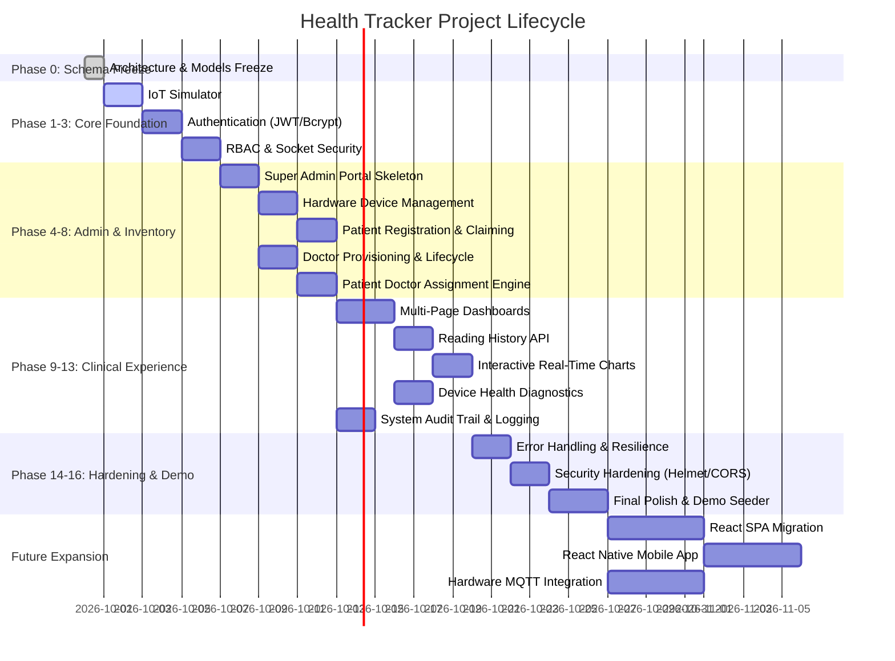

# HEALTH TRACKER — PROJECT STATUS DASHBOARD
**Live Executive Progress & Milestone Report**

---

## EXECUTIVE SUMMARY

| Metric | Status |
| :--- | :--- |
| **Current Phase** | **PHASE 1: IoT Automated Simulator** (Ready to start) |
| **Current Task** | `TASK-1.1: Multi-device headless simulator script` |
| **Overall Progress** | **17.4%** (8 of 46 tasks completed across 20 phases) |
| **Completed Phases** | **Phase 0: Architecture & Database Schema Freeze** (1 / 20) |
| **Active Tasks** | None |
| **Blocked Tasks** | None |
| **Upcoming Tasks** | `TASK-1.1`, `TASK-1.2` (Phase 1 deliverables) |
| **Verification Status** | Phase 0 verified: `tests/schemaValidation.test.js` passed 10/10 tests offline |
| **Last Updated Timestamp** | 2026-09-30 22:26:00 IST |

---

## PHASE EXECUTION PIPELINE

---

## MILESTONE BREAKDOWN & PROGRESS

| Phase | Phase Name | Status | Tasks (Done/Total) | Progress |
| :---: | :--- | :---: | :---: | :---: |
| **0** | Architecture & Database Schema Freeze | `DONE` | 8 / 8 | 100% |
| **1** | IoT Automated Simulator | `NOT_STARTED` | 0 / 2 | 0% |
| **2** | Authentication & Identity Foundation | `NOT_STARTED` | 0 / 5 | 0% |
| **3** | Role-Based Authorization & Socket Auth | `NOT_STARTED` | 0 / 3 | 0% |
| **4** | Super Admin Foundation & Core Dashboard | `NOT_STARTED` | 0 / 3 | 0% |
| **5** | Hardware Device Management | `NOT_STARTED` | 0 / 3 | 0% |
| **6** | Patient Registration & Device Claiming | `NOT_STARTED` | 0 / 2 | 0% |
| **7** | Doctor Management (Admin Provisioning) | `NOT_STARTED` | 0 / 4 | 0% |
| **8** | Patient ↔ Doctor Assignment Engine | `NOT_STARTED` | 0 / 2 | 0% |
| **9** | Multi-Page Dashboard Architecture | `NOT_STARTED` | 0 / 3 | 0% |
| **10** | Reading History Engine & Paginated API | `NOT_STARTED` | 0 / 2 | 0% |
| **11** | Charts & Time-Series Data Visualization | `NOT_STARTED` | 0 / 2 | 0% |
| **12** | Device Monitoring & Telemetry Health | `NOT_STARTED` | 0 / 2 | 0% |
| **13** | Centralized System Activity & Audit Trail | `NOT_STARTED` | 0 / 3 | 0% |
| **14** | Error Handling & System Robustness | `NOT_STARTED` | 0 / 3 | 0% |
| **15** | Security Hardening & Penetration Defense | `NOT_STARTED` | 0 / 2 | 0% |
| **16** | Final Prototype & Presentation Polish | `NOT_STARTED` | 0 / 2 | 0% |
| **17** | Modern Frontend Architecture (React) | `NOT_STARTED` | 0 / 1 | 0% |
| **18** | Mobile Telemetry App (React Native) | `NOT_STARTED` | 0 / 1 | 0% |
| **19** | Physical Hardware & MQTT Pipeline | `NOT_STARTED` | 0 / 1 | 0% |

---

## KNOWN DISCREPANCIES (ACTUAL CODEBASE VS FROZEN ROADMAP)
*Updated following Phase 0 completion:*

1. **Resolved in Phase 0:**
   - `User` model created (`src/models/User.js`) with role/status enums and sparse unique `profileId`.
   - `ActivityLog` model created (`src/models/ActivityLog.js`) with audit actions, actor/target types, and compound indexes.
   - Centralized system constants formalized (`src/config/constants.js`).
   - `Device.js` formalized with sparse unique index on `patientId`, `resetCount`, `lastSeen`, and case normalizer.
   - `Patient.js` formalized with `userId`, `email`, `deviceId` (sparse unique), and nullable `doctorId`.
   - `Doctor.js` formalized with `userId`, `email`, `status`, `phone`, `specialization`.
   - `SensorReading.js` formalized with nullable `doctorId` and compound indexes `{ patientId: 1, timestamp: -1 }`, `{ deviceId: 1, timestamp: -1 }`, `{ doctorId: 1, timestamp: -1 }`.
   - `src/seed/seed.js` upgraded to populate corresponding `User` credentials and reciprocal links.

2. **Route & Security Discrepancies (Scheduled for Phases 1–3):**
   - Ingestion route (`src/routes/iotRoutes.js`) returns HTTP 200 instead of HTTP 201 on write; rejects readings with 404 if `patient.doctorId` is null; lacks API key validation or rate limiting (Phase 1).
   - Dashboard routes (`src/routes/dashboardRoutes.js`) are unauthenticated single-page endpoints relying on URL params with no JWT verification or server-side RBAC (Phases 2 & 3).
   - Socket.IO server (`src/server.js`) accepts unauthenticated handshake connections and client-emitted `join-room` events with arbitrary claims (Phase 3).
   - Admin routes and views do not exist yet (Phase 4).

---

## NEXT IMMEDIATE ACTIONS
1. Commit Phase 0 implementation and push to GitHub.
2. Await instruction to start Phase 1.
3. In Phase 1: Implement `tests/iotSimulator.js` headless simulator script and align `/api/iot/data` response codes.
